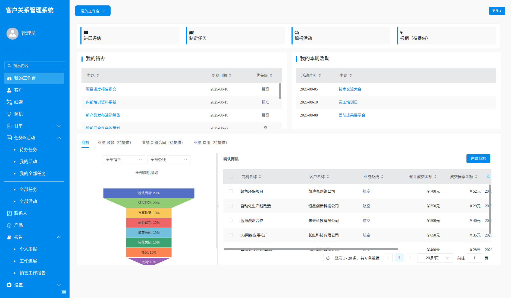
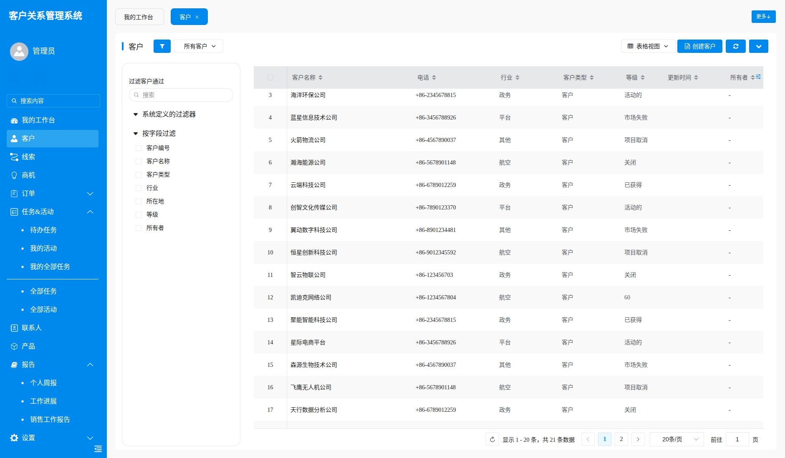
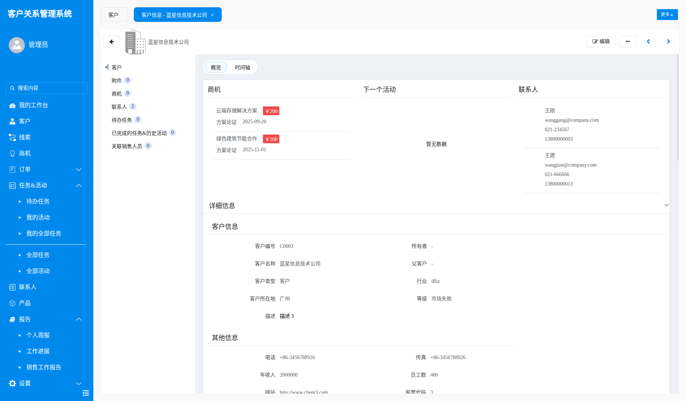
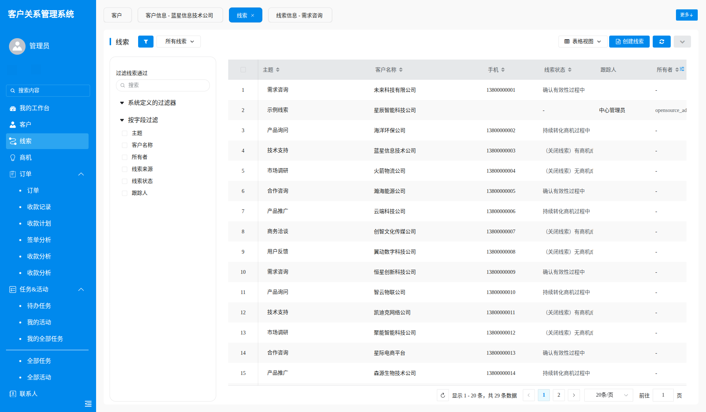
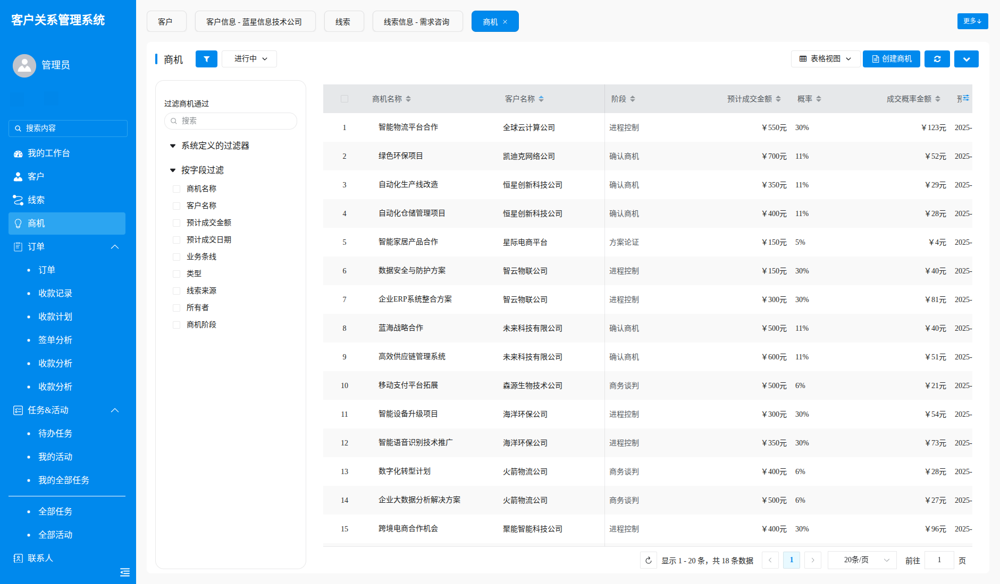
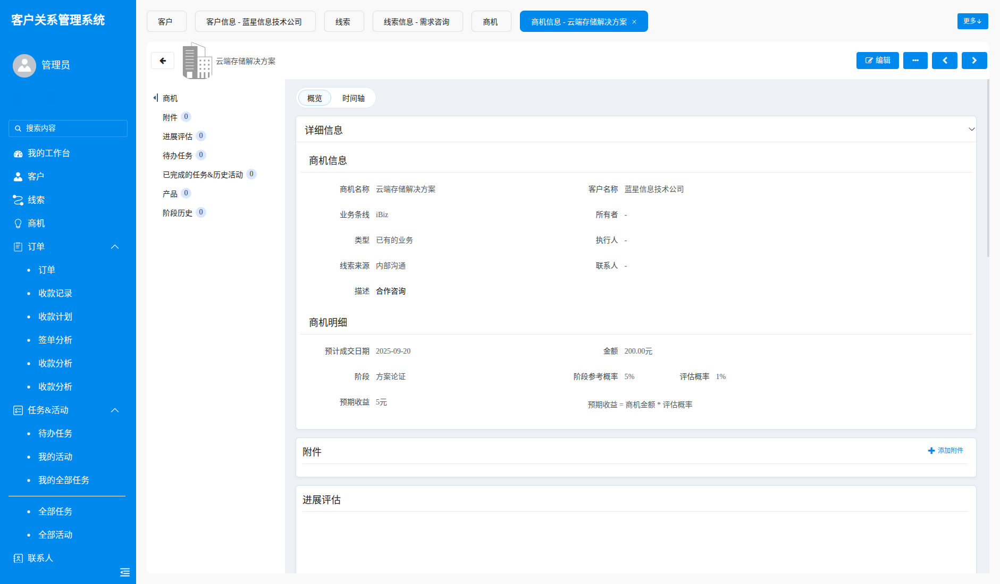
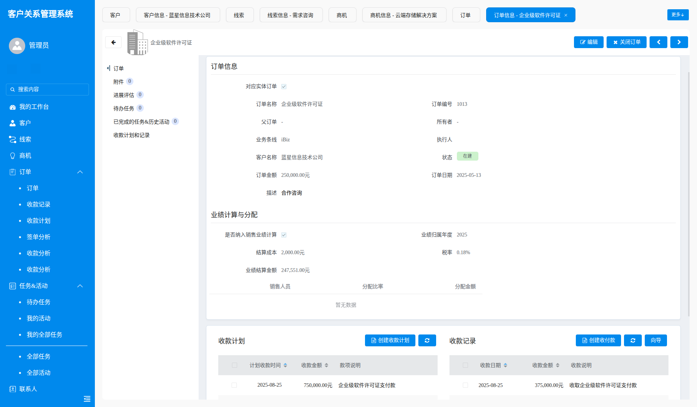
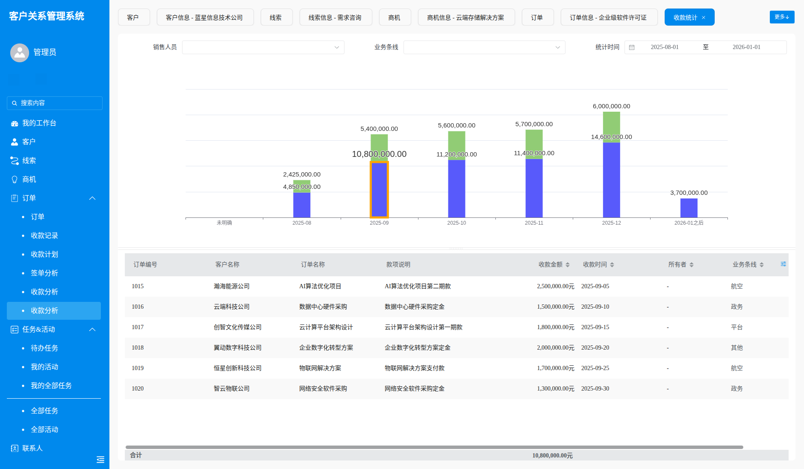
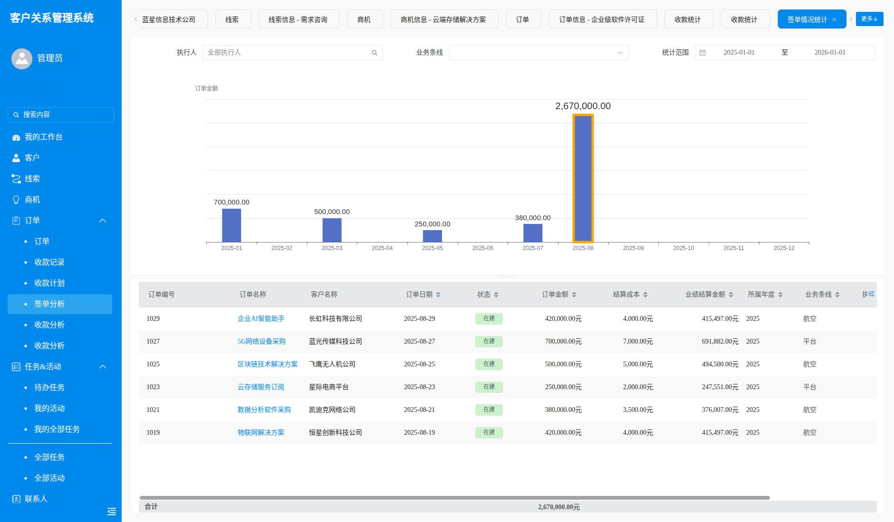
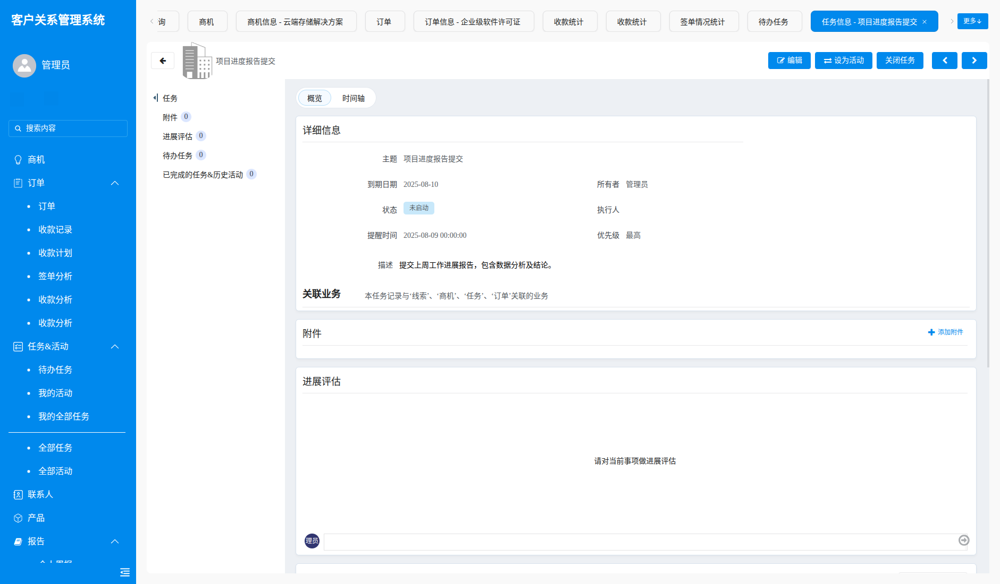

# 🚀 欢迎来到 iBizCRM

**现代化、企业级、开源 CRM 系统**，基于 [iBizModeling](https://modeling.ibizlab.cn/) 建模开发平台打造，来自 [iBizLab 开源实验室](https://www.ibizlab.cn/) 的又一开源力作。在用户体验、功能深度与业务自动化方面，iBizCRM 借鉴了卓豪 Zoho CRM 的优秀理念，提供强大又灵活的客户关系管理能力。

💡 **本地部署 · 数据安全可控 · 高度可定制**

---

## 🌐 在线体验

- **官方网站**: [https://crm.ibizlab.cn](https://crm.ibizlab.cn)
- **Demo 地址**：[https://crm.ibizlab.cn/demo/](https://crm.ibizlab.cn/demo/)
- **用户名 / 密码**：`demo_admin / 123456`
- **技术资料**: [https://crm.ibizlab.cn/doc/](https://crm.ibizlab.cn/doc/)
- **ModelingIDE** [https://crm.ibizlab.cn/modeling/](https://crm.ibizlab.cn/modeling/)
- **前端技术框架支持** [https://open.ibizlab.cn/apphub/](https://open.ibizlab.cn/apphub/)
---

## ✨ 为什么选择 iBizCRM？

- **💡 开源自由** — 代码完全开放，免费使用、修改和分发，拥有对系统的完全控制权，告别厂商锁定。企业可按需深度定制，确保系统不被供应商左右，拥有完全自主权。
- **🔓 本地部署** — 采用非云端架构，所有企业数据都存储在您自己的服务器上，确保数据绝对安全可控，避免泄露风险。适合对数据隐私和安全合规有极高要求的企业。
- **💪 功能强大** — 借鉴zoho成熟经验，打造了一个功能全面的平台。覆盖销售、营销、服务等核心业务场景，提供从线索到商机的全套方案，帮助企业高效管理。
- **⚙️ 灵活定制** — 系统提供高度灵活性，模块、布局和工作流都可通过iBizModeling工具深度定制。让系统完美贴合您的工作习惯和业务流程，随企业一同成长和变化。
- **🧑‍🤝‍🧑 社区驱动** — iBizCRM由活跃的开源社区共同维护与发展。产品持续获得优化、功能扩展和修复。每个贡献都让系统成为真正由用户驱动不断进化的企业级解决方案。

---

## 🔍 核心功能

### 🖥 主页工作台
- 提供预设的、高效的业务总览视图，让您在第一时间掌握关键业务数据和待办事项，无需繁琐的筛选和查找，从而提升工作效率。


### 👥 客户关系管理
- **线索**：支持多视图筛选，帮助您快速找到并管理潜在客户；集成的附件管理和活动跟踪功能，确保所有与线索的互动历史清晰可见；同时，可以与产品关联，为销售转化打下坚实基础。
- **联系人**：提供多视图筛选和附件管理，便于集中管理所有客户的联系信息；详细的活动记录功能，让您能完整追踪与客户的每一次沟通，建立更稳固的关系。
- **客户**：提供完整的客户视图，能够关联和管理其下的联系人、商机、活动记录和负责销售人员信息，帮助您全面了解和维护客户关系，实现精细化管理。

### 📈 销售自动化
- **商机**：支持阶段历史、活动、任务和产品信息的全方位追踪。通过可视化销售管道，您可以清晰了解每个商机的进展情况，系统化管理从初次接触到最终成交的整个销售周期。

### 🛠 服务与支持
- **任务管理**：提供直观的任务视图和详情查看功能，帮助团队高效分配、执行和跟踪工作。每个任务的详细信息都一目了然，确保所有工作都能按时完成，提升团队协作效率。
- **报告管理**：支持个人周报、工作进展报告的提交与管理，并为管理层提供多维度的销售工作报告，帮助团队更好地进行内部沟通与汇报，并支持管理者从宏观角度洞察团队绩效。

### 💰 财务管理
- **订单收款计划**：支持根据订单情况制定详细的收款计划，并跟踪其执行情况，确保资金流动的健康。
- **收款分析**：通过对收款记录的统计与分析，帮助您洞察回款情况，识别潜在风险，优化财务策略。
- **产品管理**：提供统一的产品数据管理功能，确保所有产品信息在系统中的一致性，便于销售、库存和财务部门的协同工作。

### 📊 数据分析与报告
- **报表中心**：提供强大的报表生成与导出功能，支持多维度的数据筛选和分析。您可以根据需求自定义报表，如销售业绩报表、客户活跃度报表等，为决策提供有力的数据支持。

---

## ⚡ 快速上手

### 环境要求
- **CPU**：≥ 4 核
- **RAM**：≥ 16 GB
- **Disk**：≥ 50 GB
- **Docker**：≥ 24.0.0
- **Docker Compose**：≥ v2.26.1

### 安装步骤

1. **克隆项目**
   ```bash
   git clone https://gitee.com/ibizlab/crm.git


#### **1\. 前置条件**

- CPU >= 4 核
- RAM >= 16 GB
- Disk >= 50 GB
- Docker >= 24.0.0 & Docker Compose >= v2.26.1

#### **2\. 安装指南**

克隆项目仓库  
```bash
git clone https://gitee.com/ibizlab/crm.git
```

进入 **compose** 文件夹，利用提前编译好的 Docker 镜像启动服务器：


```bash
$ cd crm/deploy/compose
$ docker compose -f docker-compose.yml --env-file .env up -d

# ARM64架构启动:
# docker compose -f docker-compose-arm64.yml --env-file .env up -d

```

> [!TIP]
> 如果你想修改MySQL、ZooKeeper、Redis、Nacos、EMQX、ebsx服务为本地已有服务，可以在 **deploy/compose/.env** 文件内根据变量注释提示调整对应参数；调整MySQL服务为本地服务需要预先导入deploy/compose/init.sql。

> [!CAUTION]
> 如果你已经安装过iBizLab的其他开源产品，比如iBizPLM，这种情况下MySQL、zk、Nacos、ebsx等环境已具备，可以使用 .share 启动，执行前请自行在mysql中创建crm数据库。
> ```
> create database crm default character set utf8 collate utf8_general_ci;
> create user 'crm'@'%' identified by 'crm@2024';
> grant ALL PRIVILEGES on crm.* to 'crm'@'%' ;
> ```
> ```bash
> $ cd crm/deploy/compose
> $ docker compose -f docker-compose.yml --env-file .share up -d
> # ARM64架构启动:
> # docker compose -f docker-compose-arm64.yml --env-file .share up -d
> ```

## 📸 演示图




















 


## 🤝 如何贡献

我们非常欢迎社区的贡献！如果您有兴趣，请通过以下方式参与：

* **报告 Bug**：如果您发现了任何问题，请通过 GITEE Issues提交。  
* **提交建议**：欢迎提出任何关于新功能或改进的建议。  
* **提交代码**：请遵循我们的贡献指南，提交 Pull Request。

## 📜 许可证

iBizCRM 采用 **MIT License** 许可证。详情请参阅项目根目录下的 LICENSE 文件。

## ❤️ 加入我们
我们致力于为中小企业提供一个功能强大、灵活可定制且完全开源的解决方案，帮助您高效管理销售、营销和客户服务，从而建立和维护牢固的客户关系。

感谢您对 iBizCRM 的关注！让我们一起打造最棒的开源CRM系统吧！


- 🌐 开源实验室官网：https://www.ibizlab.cn

- 💬 开源社区：https://open.ibizlab.cn

- 📱 微信公众号：iBiz开放平台

- 💬 QQ交流群：1056401976