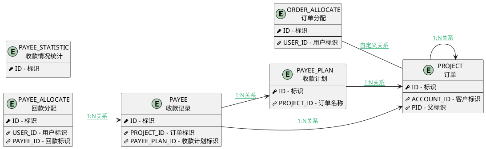

# 订单 <!-- {docsify-ignore-all} -->

```plantuml
@startuml
skinparam svgLinkTarget _blank
<style>
root {
  HyperlinkColor #42b983
}
</style>
left to right direction

entity "ORDER_ALLOCATE\n订单分配" as ORDER_ALLOCATE [[$../module/crm/order_allocate {订单分配}]] {
        <&key> ID - 标识
        --
        <&link-intact> USER_ID - 用户标识
}
entity "PAYEE\n收款记录" as PAYEE [[$../module/crm/payee {收款记录}]] {
        <&key> ID - 标识
        --
        <&link-intact> PROJECT_ID - 订单标识
        <&link-intact> PAYEE_PLAN_ID - 收款计划标识
}
entity "PAYEE_ALLOCATE\n回款分配" as PAYEE_ALLOCATE [[$../module/crm/payee_allocate {回款分配}]] {
        <&key> ID - 标识
        --
        <&link-intact> USER_ID - 用户标识
        <&link-intact> PAYEE_ID - 回款标识
}
entity "PAYEE_PLAN\n收款计划" as PAYEE_PLAN [[$../module/crm/payee_plan {收款计划}]] {
        <&key> ID - 标识
        --
        <&link-intact> PROJECT_ID - 订单名称
}
entity "PAYEE_STATISTIC\n收款情况统计" as PAYEE_STATISTIC [[$../module/crm/payee_statistic {收款情况统计}]] {
        <&key> ID - 标识
        --
}
entity "PROJECT\n订单" as PROJECT [[$../module/crm/project {订单}]] {
        <&key> ID - 标识
        --
        <&link-intact> ACCOUNT_ID - 客户标识
        <&link-intact> PID - 父标识
}

PAYEE_ALLOCATE--> PAYEE : [[$../der/DER1N_PAYEE_ALLOCATE_PAYEE_PAYEE_ID{DER1N_PAYEE_ALLOCATE_PAYEE_PAYEE_ID} 1:N关系]]
PAYEE--> PAYEE_PLAN : [[$../der/DER1N_PAYEE_PAYEE_PLAN_PAYEE_PLAN_ID{DER1N_PAYEE_PAYEE_PLAN_PAYEE_PLAN_ID} 1:N关系]]
PAYEE_PLAN--> PROJECT : [[$../der/DER1N_PAYEE_PLAN_PROJECT_PROJECT_ID{DER1N_PAYEE_PLAN_PROJECT_PROJECT_ID} 1:N关系]]
PAYEE--> PROJECT : [[$../der/DER1N_PAYEE_PROJECT_PROJECT_ID{DER1N_PAYEE_PROJECT_PROJECT_ID} 1:N关系]]
PROJECT--> PROJECT : [[$../der/DER1N_PROJECT_PROJECT_PID{DER1N_PROJECT_PROJECT_PID} 1:N关系]]
ORDER_ALLOCATE-- PROJECT : [[$../der/DERCUSTOM_ORDER_ALLOCATE_PROJECT{DERCUSTOM_ORDER_ALLOCATE_PROJECT} 自定义关系]]


hide methods
@enduml
```
