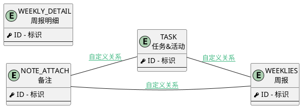

# 周报管理 <!-- {docsify-ignore-all} -->

```plantuml
@startuml
skinparam svgLinkTarget _blank
<style>
root {
  HyperlinkColor #42b983
}
</style>
left to right direction

entity "NOTE_ATTACH\n备注" as NOTE_ATTACH [[$../module/crm/note_attach {备注}]] {
        <&key> ID - 标识
        --
}
entity "TASK\n任务&活动" as TASK [[$../module/crm/task {任务&活动}]] {
        <&key> ID - 标识
        --
}
entity "WEEKLIES\n周报" as WEEKLIES [[$../module/crm/weeklies {周报}]] {
        <&key> ID - 标识
        --
}
entity "WEEKLY_DETAIL\n周报明细" as WEEKLY_DETAIL [[$../module/crm/weekly_detail {周报明细}]] {
        <&key> ID - 标识
        --
}

NOTE_ATTACH-- TASK : [[$../der/DERCUSTOM_NOTE_ATTACH_TASK{DERCUSTOM_NOTE_ATTACH_TASK} 自定义关系]]
NOTE_ATTACH-- WEEKLIES : [[$../der/DERCUSTOM_NOTE_ATTACH_WEEKLIES{DERCUSTOM_NOTE_ATTACH_WEEKLIES} 自定义关系]]
TASK-- WEEKLIES : [[$../der/DERCUSTOM_TASK_WEEKLIES{DERCUSTOM_TASK_WEEKLIES} 自定义关系]]


hide methods
@enduml
```
