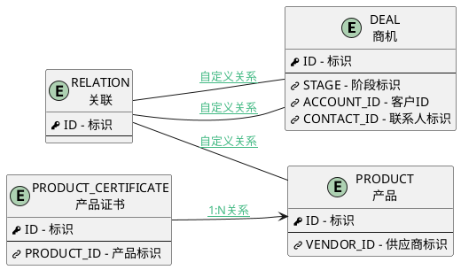

# 产品 <!-- {docsify-ignore-all} -->

```plantuml
@startuml
skinparam svgLinkTarget _blank
<style>
root {
  HyperlinkColor #42b983
}
</style>
left to right direction

entity "DEAL\n商机" as DEAL [[$../module/crm/deal {商机}]] {
        <&key> ID - 标识
        --
        <&link-intact> STAGE - 阶段标识
        <&link-intact> ACCOUNT_ID - 客户ID
        <&link-intact> CONTACT_ID - 联系人标识
}
entity "PRODUCT\n产品" as PRODUCT [[$../module/crm/product {产品}]] {
        <&key> ID - 标识
        --
        <&link-intact> VENDOR_ID - 供应商标识
}
entity "PRODUCT_CERTIFICATE\n产品证书" as PRODUCT_CERTIFICATE [[$../module/crm/product_certificate {产品证书}]] {
        <&key> ID - 标识
        --
        <&link-intact> PRODUCT_ID - 产品标识
}
entity "RELATION\n关联" as RELATION [[$../module/crm/relation {关联}]] {
        <&key> ID - 标识
        --
}

RELATION-- DEAL : [[$../der/DERCUSTOM_DEAL_RELATION{DERCUSTOM_DEAL_RELATION} 自定义关系]]
RELATION-- DEAL : [[$../der/DERCUSTOM_TARGET_DEAL_RELATION{DERCUSTOM_TARGET_DEAL_RELATION} 自定义关系]]
PRODUCT_CERTIFICATE--> PRODUCT : [[$../der/DER1N_PRODUCT_CERTIFICATE_PRODUCT_PRODUCT_ID{DER1N_PRODUCT_CERTIFICATE_PRODUCT_PRODUCT_ID} 1:N关系]]
RELATION-- PRODUCT : [[$../der/DERCUSTOM_TARGET_PRODUCT_RELATION{DERCUSTOM_TARGET_PRODUCT_RELATION} 自定义关系]]


hide methods
@enduml
```
