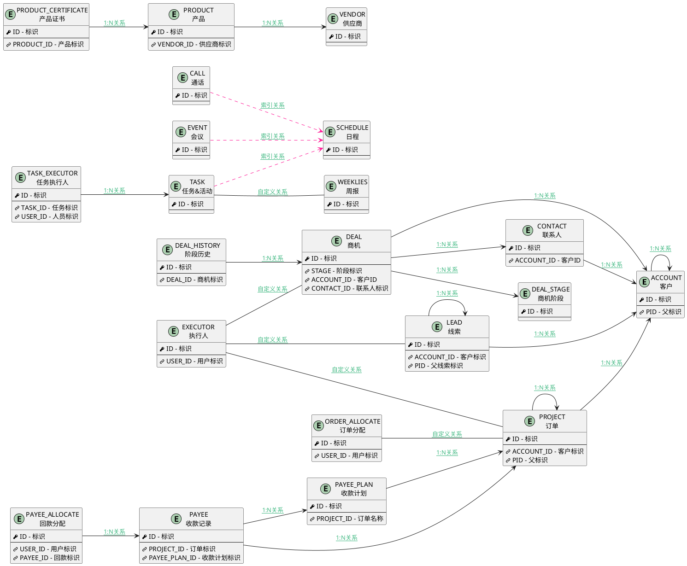

# 主模型 <!-- {docsify-ignore-all} -->

```plantuml
@startuml
skinparam svgLinkTarget _blank
<style>
root {
  HyperlinkColor #42b983
}
</style>
left to right direction

entity "ACCOUNT\n客户" as ACCOUNT [[$../module/crm/account {客户}]] {
        <&key> ID - 标识
        --
        <&link-intact> PID - 父标识
}
entity "CALL\n通话" as CALL [[$../module/crm/call {通话}]] {
        <&key> ID - 标识
        --
}
entity "CONTACT\n联系人" as CONTACT [[$../module/crm/contact {联系人}]] {
        <&key> ID - 标识
        --
        <&link-intact> ACCOUNT_ID - 客户ID
}
entity "DEAL\n商机" as DEAL [[$../module/crm/deal {商机}]] {
        <&key> ID - 标识
        --
        <&link-intact> STAGE - 阶段标识
        <&link-intact> ACCOUNT_ID - 客户ID
        <&link-intact> CONTACT_ID - 联系人标识
}
entity "DEAL_HISTORY\n阶段历史" as DEAL_HISTORY [[$../module/crm/deal_history {阶段历史}]] {
        <&key> ID - 标识
        --
        <&link-intact> DEAL_ID - 商机标识
}
entity "DEAL_STAGE\n商机阶段" as DEAL_STAGE [[$../module/crm/deal_stage {商机阶段}]] {
        <&key> ID - 标识
        --
}
entity "EVENT\n会议" as EVENT [[$../module/crm/event {会议}]] {
        <&key> ID - 标识
        --
}
entity "EXECUTOR\n执行人" as EXECUTOR [[$../module/crm/executor {执行人}]] {
        <&key> ID - 标识
        --
        <&link-intact> USER_ID - 用户标识
}
entity "LEAD\n线索" as LEAD [[$../module/crm/lead {线索}]] {
        <&key> ID - 标识
        --
        <&link-intact> ACCOUNT_ID - 客户标识
        <&link-intact> PID - 父线索标识
}
entity "ORDER_ALLOCATE\n订单分配" as ORDER_ALLOCATE [[$../module/crm/order_allocate {订单分配}]] {
        <&key> ID - 标识
        --
        <&link-intact> USER_ID - 用户标识
}
entity "PAYEE\n收款记录" as PAYEE [[$../module/crm/payee {收款记录}]] {
        <&key> ID - 标识
        --
        <&link-intact> PROJECT_ID - 订单标识
        <&link-intact> PAYEE_PLAN_ID - 收款计划标识
}
entity "PAYEE_ALLOCATE\n回款分配" as PAYEE_ALLOCATE [[$../module/crm/payee_allocate {回款分配}]] {
        <&key> ID - 标识
        --
        <&link-intact> USER_ID - 用户标识
        <&link-intact> PAYEE_ID - 回款标识
}
entity "PAYEE_PLAN\n收款计划" as PAYEE_PLAN [[$../module/crm/payee_plan {收款计划}]] {
        <&key> ID - 标识
        --
        <&link-intact> PROJECT_ID - 订单名称
}
entity "PRODUCT\n产品" as PRODUCT [[$../module/crm/product {产品}]] {
        <&key> ID - 标识
        --
        <&link-intact> VENDOR_ID - 供应商标识
}
entity "PRODUCT_CERTIFICATE\n产品证书" as PRODUCT_CERTIFICATE [[$../module/crm/product_certificate {产品证书}]] {
        <&key> ID - 标识
        --
        <&link-intact> PRODUCT_ID - 产品标识
}
entity "PROJECT\n订单" as PROJECT [[$../module/crm/project {订单}]] {
        <&key> ID - 标识
        --
        <&link-intact> ACCOUNT_ID - 客户标识
        <&link-intact> PID - 父标识
}
entity "SCHEDULE\n日程" as SCHEDULE [[$../module/crm/schedule {日程}]] {
        <&key> ID - 标识
        --
}
entity "TASK\n任务&活动" as TASK [[$../module/crm/task {任务&活动}]] {
        <&key> ID - 标识
        --
}
entity "TASK_EXECUTOR\n任务执行人" as TASK_EXECUTOR [[$../module/crm/task_executor {任务执行人}]] {
        <&key> ID - 标识
        --
        <&link-intact> TASK_ID - 任务标识
        <&link-intact> USER_ID - 人员标识
}
entity "VENDOR\n供应商" as VENDOR [[$../module/crm/vendor {供应商}]] {
        <&key> ID - 标识
        --
}
entity "WEEKLIES\n周报" as WEEKLIES [[$../module/crm/weeklies {周报}]] {
        <&key> ID - 标识
        --
}

ACCOUNT--> ACCOUNT : [[$../der/DER1N_ACCOUNT_ACCOUNT_PID{DER1N_ACCOUNT_ACCOUNT_PID} 1:N关系]]
CONTACT--> ACCOUNT : [[$../der/DER1N_CONTACT_ACCOUNT_ACCOUNT_ID{DER1N_CONTACT_ACCOUNT_ACCOUNT_ID} 1:N关系]]
DEAL--> ACCOUNT : [[$../der/DER1N_DEAL_ACCOUNT_ACCOUNT_ID{DER1N_DEAL_ACCOUNT_ACCOUNT_ID} 1:N关系]]
LEAD--> ACCOUNT : [[$../der/DER1N_LEAD_ACCOUNT_ACCOUNT_ID{DER1N_LEAD_ACCOUNT_ACCOUNT_ID} 1:N关系]]
PROJECT--> ACCOUNT : [[$../der/DER1N_PROJECT_ACCOUNT_ACCOUNT_ID{DER1N_PROJECT_ACCOUNT_ACCOUNT_ID} 1:N关系]]
DEAL--> CONTACT : [[$../der/DER1N_DEAL_CONTACT_CONTACT_ID{DER1N_DEAL_CONTACT_CONTACT_ID} 1:N关系]]
DEAL_HISTORY--> DEAL : [[$../der/DER1N_DEAL_HISTORY_DEAL_DEAL_ID{DER1N_DEAL_HISTORY_DEAL_DEAL_ID} 1:N关系]]
EXECUTOR-- DEAL : [[$../der/DERCUSTOM_EXECUTOR_DEAL{DERCUSTOM_EXECUTOR_DEAL} 自定义关系]]
DEAL--> DEAL_STAGE : [[$../der/DER1N_DEAL_DEAL_STAGE_STAGE{DER1N_DEAL_DEAL_STAGE_STAGE} 1:N关系]]
LEAD--> LEAD : [[$../der/DER1N_LEAD_LEAD_PID{DER1N_LEAD_LEAD_PID} 1:N关系]]
EXECUTOR-- LEAD : [[$../der/DERCUSTOM_EXECUTOR_LEAD{DERCUSTOM_EXECUTOR_LEAD} 自定义关系]]
PAYEE_ALLOCATE--> PAYEE : [[$../der/DER1N_PAYEE_ALLOCATE_PAYEE_PAYEE_ID{DER1N_PAYEE_ALLOCATE_PAYEE_PAYEE_ID} 1:N关系]]
PAYEE--> PAYEE_PLAN : [[$../der/DER1N_PAYEE_PAYEE_PLAN_PAYEE_PLAN_ID{DER1N_PAYEE_PAYEE_PLAN_PAYEE_PLAN_ID} 1:N关系]]
PRODUCT_CERTIFICATE--> PRODUCT : [[$../der/DER1N_PRODUCT_CERTIFICATE_PRODUCT_PRODUCT_ID{DER1N_PRODUCT_CERTIFICATE_PRODUCT_PRODUCT_ID} 1:N关系]]
PAYEE_PLAN--> PROJECT : [[$../der/DER1N_PAYEE_PLAN_PROJECT_PROJECT_ID{DER1N_PAYEE_PLAN_PROJECT_PROJECT_ID} 1:N关系]]
PAYEE--> PROJECT : [[$../der/DER1N_PAYEE_PROJECT_PROJECT_ID{DER1N_PAYEE_PROJECT_PROJECT_ID} 1:N关系]]
PROJECT--> PROJECT : [[$../der/DER1N_PROJECT_PROJECT_PID{DER1N_PROJECT_PROJECT_PID} 1:N关系]]
EXECUTOR-- PROJECT : [[$../der/DERCUSTOM_EXECUTOR_PROJECT{DERCUSTOM_EXECUTOR_PROJECT} 自定义关系]]
ORDER_ALLOCATE-- PROJECT : [[$../der/DERCUSTOM_ORDER_ALLOCATE_PROJECT{DERCUSTOM_ORDER_ALLOCATE_PROJECT} 自定义关系]]
CALL.[#deeppink].> SCHEDULE : [[$../der/DERINDEX_CALL_SCHEDULE{DERINDEX_CALL_SCHEDULE} 索引关系]]
EVENT.[#deeppink].> SCHEDULE : [[$../der/DERINDEX_EVENT_SCHEDULE{DERINDEX_EVENT_SCHEDULE} 索引关系]]
TASK.[#deeppink].> SCHEDULE : [[$../der/DERINDEX_TASK_SCHEDULE{DERINDEX_TASK_SCHEDULE} 索引关系]]
TASK_EXECUTOR--> TASK : [[$../der/DER1N_TASK_EXECUTOR_TASK_TASK_ID{DER1N_TASK_EXECUTOR_TASK_TASK_ID} 1:N关系]]
PRODUCT--> VENDOR : [[$../der/DER1N_PRODUCT_VENDOR_VENDOR_ID{DER1N_PRODUCT_VENDOR_VENDOR_ID} 1:N关系]]
TASK-- WEEKLIES : [[$../der/DERCUSTOM_TASK_WEEKLIES{DERCUSTOM_TASK_WEEKLIES} 自定义关系]]


hide methods
@enduml
```
