## 获取客户信息 <!-- {docsify-ignore-all} -->

   

### 处理过程

```plantuml
@startuml
hide empty description
<style>
root {
  HyperlinkColor #42b983
}
</style>

hide empty description
state "开始" as Begin <<start>> [[$./findAccount#begin {"开始"}]]
state "结束" as END1 <<end>> [[$./findAccount#end1 {"结束"}]]
state "准备参数" as PREPAREPARAM2  [[$./findAccount#prepareparam2 {"准备参数"}]]
state "实体行为" as DEACTION1  [[$./findAccount#deaction1 {"实体行为"}]]
state "调试逻辑参数" as DEBUGPARAM1  [[$./findAccount#debugparam1 {"调试逻辑参数"}]]


Begin --> PREPAREPARAM2 : [[$./findAccount#begin-prepareparam2{连接名称} 连接名称]]
PREPAREPARAM2 --> DEACTION1
DEACTION1 --> DEBUGPARAM1
DEBUGPARAM1 --> END1


@enduml
```

### 处理步骤说明

#### 结束 :id=END1 [结束]

返回 `Account(客户)`

#### 开始 :id=Begin [开始]

*- N/A*
#### 准备参数 :id=PREPAREPARAM2 [准备参数]

1. 将`Default(传入变量).ID(标识)` 设置给  `Account(客户).ID(标识)`

#### 实体行为 :id=DEACTION1 [实体行为]

调用实体 [客户(ACCOUNT)](module/crm/account.md) 行为 [Get](module/crm/account#行为) ，行为参数为`Account(客户)`

将执行结果返回给参数`Account(客户)`

#### 调试逻辑参数 :id=DEBUGPARAM1 [调试逻辑参数]

> [!NOTE|label:调试信息|icon:fa fa-bug]
> 调试输出参数`Account(客户)`的详细信息

### 连接条件说明
#### 连接名称 :id=Begin-PREPAREPARAM2

`Default(传入变量).ID(标识)` ISNOTNULL

### 实体逻辑参数

|    中文名   |    代码名    |  数据类型    |  实体   |备注 |
| --------| --------| -------- | -------- | --------   |
|传入变量(<i class="fa fa-check"/></i>)|Default|数据对象|[客户(ACCOUNT)](module/crm/account.md)||
|客户|Account|数据对象|[客户(ACCOUNT)](module/crm/account.md)||
|概率|probability|简单数据|||
