## 合并客户 <!-- {docsify-ignore-all} -->

   在填入重复客户的时候将客户合并为一个

### 处理过程

```plantuml
@startuml
hide empty description
<style>
root {
  HyperlinkColor #42b983
}
</style>

hide empty description
state "开始" as Begin <<start>> [[$./marge_account#begin {"开始"}]]
state "准备参数" as PREPAREPARAM1  [[$./marge_account#prepareparam1 {"准备参数"}]]
state "准备参数" as PREPAREPARAM3  [[$./marge_account#prepareparam3 {"准备参数"}]]
state "准备参数" as PREPAREPARAM4  [[$./marge_account#prepareparam4 {"准备参数"}]]
state "准备参数" as PREPAREPARAM6  [[$./marge_account#prepareparam6 {"准备参数"}]]
state "实体数据集" as DEDATASET1  [[$./marge_account#dedataset1 {"实体数据集"}]]
state "实体数据集" as DEDATASET3  [[$./marge_account#dedataset3 {"实体数据集"}]]
state "实体数据集" as DEDATASET4  [[$./marge_account#dedataset4 {"实体数据集"}]]
state "准备参数" as PREPAREPARAM2  [[$./marge_account#prepareparam2 {"准备参数"}]]
state "准备参数" as PREPAREPARAM5  [[$./marge_account#prepareparam5 {"准备参数"}]]
state "准备参数" as PREPAREPARAM7  [[$./marge_account#prepareparam7 {"准备参数"}]]
state "准备参数" as PREPAREPARAM8  [[$./marge_account#prepareparam8 {"准备参数"}]]
state "实体数据集" as DEDATASET2  [[$./marge_account#dedataset2 {"实体数据集"}]]
state "实体数据集" as DEDATASET5  [[$./marge_account#dedataset5 {"实体数据集"}]]
state "实体数据集" as DEDATASET6  [[$./marge_account#dedataset6 {"实体数据集"}]]
state "实体数据集" as DEDATASET7  [[$./marge_account#dedataset7 {"实体数据集"}]]
state "实体数据集" as DEDATASET8  [[$./marge_account#dedataset8 {"实体数据集"}]]
state "循环子调用" as LOOPSUBCALL3  [[$./marge_account#loopsubcall3 {"循环子调用"}]] #green {
state "准备参数" as PREPAREPARAM12  [[$./marge_account#prepareparam12 {"准备参数"}]]
state "实体行为" as DEACTION4  [[$./marge_account#deaction4 {"实体行为"}]]
}
state "循环子调用" as LOOPSUBCALL1  [[$./marge_account#loopsubcall1 {"循环子调用"}]] #green {
state "准备参数" as PREPAREPARAM10  [[$./marge_account#prepareparam10 {"准备参数"}]]
state "实体行为" as DEACTION2  [[$./marge_account#deaction2 {"实体行为"}]]
}
state "循环子调用" as LOOPSUBCALL2  [[$./marge_account#loopsubcall2 {"循环子调用"}]] #green {
state "准备参数" as PREPAREPARAM11  [[$./marge_account#prepareparam11 {"准备参数"}]]
state "实体行为" as DEACTION3  [[$./marge_account#deaction3 {"实体行为"}]]
}
state "循环子调用" as LOOPSUBCALL4  [[$./marge_account#loopsubcall4 {"循环子调用"}]] #green {
state "准备参数" as PREPAREPARAM13  [[$./marge_account#prepareparam13 {"准备参数"}]]
state "实体行为" as DEACTION5  [[$./marge_account#deaction5 {"实体行为"}]]
}
state "循环子调用" as LOOPSUBCALL5  [[$./marge_account#loopsubcall5 {"循环子调用"}]] #green {
state "准备参数" as PREPAREPARAM14  [[$./marge_account#prepareparam14 {"准备参数"}]]
state "实体行为" as DEACTION6  [[$./marge_account#deaction6 {"实体行为"}]]
}
state "循环子调用" as LOOPSUBCALL6  [[$./marge_account#loopsubcall6 {"循环子调用"}]] #green {
state "准备参数" as PREPAREPARAM15  [[$./marge_account#prepareparam15 {"准备参数"}]]
state "实体行为" as DEACTION7  [[$./marge_account#deaction7 {"实体行为"}]]
}
state "循环子调用" as LOOPSUBCALL7  [[$./marge_account#loopsubcall7 {"循环子调用"}]] #green {
state "准备参数" as PREPAREPARAM16  [[$./marge_account#prepareparam16 {"准备参数"}]]
state "实体行为" as DEACTION8  [[$./marge_account#deaction8 {"实体行为"}]]
}
state "循环子调用" as LOOPSUBCALL8  [[$./marge_account#loopsubcall8 {"循环子调用"}]] #green {
state "准备参数" as PREPAREPARAM17  [[$./marge_account#prepareparam17 {"准备参数"}]]
state "实体行为" as DEACTION9  [[$./marge_account#deaction9 {"实体行为"}]]
}


Begin --> PREPAREPARAM1
PREPAREPARAM1 --> DEDATASET1
DEDATASET1 --> LOOPSUBCALL2 : [[$./marge_account#dedataset1-loopsubcall2{连接名称} 连接名称]]
LOOPSUBCALL2 --> PREPAREPARAM11
PREPAREPARAM11 --> DEACTION3
Begin --> PREPAREPARAM3
PREPAREPARAM3 --> DEDATASET3
DEDATASET3 --> LOOPSUBCALL3 : [[$./marge_account#dedataset3-loopsubcall3{连接名称} 连接名称]]
LOOPSUBCALL3 --> PREPAREPARAM12
PREPAREPARAM12 --> DEACTION4
Begin --> PREPAREPARAM4
PREPAREPARAM4 --> DEDATASET4
DEDATASET4 --> LOOPSUBCALL4 : [[$./marge_account#dedataset4-loopsubcall4{连接名称} 连接名称]]
LOOPSUBCALL4 --> PREPAREPARAM13
PREPAREPARAM13 --> DEACTION5
Begin --> PREPAREPARAM6
PREPAREPARAM6 --> DEDATASET5
DEDATASET5 --> LOOPSUBCALL5 : [[$./marge_account#dedataset5-loopsubcall5{连接名称} 连接名称]]
LOOPSUBCALL5 --> PREPAREPARAM14
PREPAREPARAM14 --> DEACTION6
Begin --> PREPAREPARAM5
PREPAREPARAM5 --> DEDATASET6
DEDATASET6 --> LOOPSUBCALL6 : [[$./marge_account#dedataset6-loopsubcall6{连接名称} 连接名称]]
LOOPSUBCALL6 --> PREPAREPARAM15
PREPAREPARAM15 --> DEACTION7
Begin --> PREPAREPARAM7
PREPAREPARAM7 --> DEDATASET7
DEDATASET7 --> LOOPSUBCALL7 : [[$./marge_account#dedataset7-loopsubcall7{连接名称} 连接名称]]
LOOPSUBCALL7 --> PREPAREPARAM16
PREPAREPARAM16 --> DEACTION8
Begin --> PREPAREPARAM8
PREPAREPARAM8 --> DEDATASET8
DEDATASET8 --> LOOPSUBCALL8 : [[$./marge_account#dedataset8-loopsubcall8{连接名称} 连接名称]]
LOOPSUBCALL8 --> PREPAREPARAM17
PREPAREPARAM17 --> DEACTION9
Begin --> PREPAREPARAM2
PREPAREPARAM2 --> DEDATASET2
DEDATASET2 --> LOOPSUBCALL1 : [[$./marge_account#dedataset2-loopsubcall1{连接名称} 连接名称]]
LOOPSUBCALL1 --> PREPAREPARAM10
PREPAREPARAM10 --> DEACTION2


@enduml
```

### 处理步骤说明

#### 开始 :id=Begin [开始]

*- N/A*
#### 准备参数 :id=PREPAREPARAM2 [准备参数]

1. 将`Default(传入变量).ID(标识)` 设置给  `lead_filter(线索过滤数据).n_account_id_eq`

#### 准备参数 :id=PREPAREPARAM1 [准备参数]

1. 将`Default(传入变量).ID(标识)` 设置给  `deal_filter(商机过滤数据).n_account_id_eq`

#### 准备参数 :id=PREPAREPARAM3 [准备参数]

1. 将`Default(传入变量).ID(标识)` 设置给  `project_filter(订单过滤数据).n_account_id_eq`

#### 准备参数 :id=PREPAREPARAM4 [准备参数]

1. 将`Default(传入变量).ID(标识)` 设置给  `contact_filter(联系人过滤数据).n_account_id_eq`

#### 准备参数 :id=PREPAREPARAM6 [准备参数]

1. 将`Default(传入变量).ID(标识)` 设置给  `relation_filter(关联过滤数据).n_principal_id_eq`
2. 将`ACCOUNT` 设置给  `relation_filter(关联过滤数据).n_principal_type_eq`

#### 准备参数 :id=PREPAREPARAM5 [准备参数]

1. 将`Default(传入变量).ID(标识)` 设置给  `custom_button_filter(链接过滤数据).n_owner_id_eq`
2. 将`ACCOUNT` 设置给  `custom_button_filter(链接过滤数据).n_owner_type_eq`

#### 准备参数 :id=PREPAREPARAM7 [准备参数]

1. 将`Default(传入变量).ID(标识)` 设置给  `note_attach_filter(备注（进展评估）过滤数据).n_principal_id_eq`
2. 将`ACCOUNT` 设置给  `note_attach_filter(备注（进展评估）过滤数据).n_principal_type_eq`

#### 准备参数 :id=PREPAREPARAM8 [准备参数]

1. 将`Default(传入变量).ID(标识)` 设置给  `attachment_filter(附件过滤数据).n_owner_id_eq`
2. 将`ACCOUNT` 设置给  `attachment_filter(附件过滤数据).n_owner_type_eq`

#### 实体数据集 :id=DEDATASET2 [实体数据集]

调用实体 [线索(LEAD)](module/crm/lead.md) 数据集合 [全部数据(all)](module/crm/lead#数据集合) ，查询参数为`lead_filter(线索过滤数据)`

将执行结果返回给参数`lead_list(线索集合)`

#### 实体数据集 :id=DEDATASET1 [实体数据集]

调用实体 [商机(DEAL)](module/crm/deal.md) 数据集合 [全部商机(All)](module/crm/deal#数据集合) ，查询参数为`deal_filter(商机过滤数据)`

将执行结果返回给参数`deal_list(商机集合)`

#### 实体数据集 :id=DEDATASET3 [实体数据集]

调用实体 [订单(PROJECT)](module/crm/project.md) 数据集合 [所有数据(all)](module/crm/project#数据集合) ，查询参数为`project_filter(订单过滤数据)`

将执行结果返回给参数`project_list(订单集合)`

#### 实体数据集 :id=DEDATASET4 [实体数据集]

调用实体 [联系人(CONTACT)](module/crm/contact.md) 数据集合 [全部联系人(all)](module/crm/contact#数据集合) ，查询参数为`contact_filter(联系人过滤数据)`

将执行结果返回给参数`contact_list(联系人集合)`

#### 实体数据集 :id=DEDATASET5 [实体数据集]

调用实体 [关联(RELATION)](module/crm/relation.md) 数据集合 [全部数据(all)](module/crm/relation#数据集合) ，查询参数为`relation_filter(关联过滤数据)`

将执行结果返回给参数`relation_list(关联数据集合)`

#### 实体数据集 :id=DEDATASET6 [实体数据集]

调用实体 [链接(CUSTOM_BUTTON)](module/crm/custom_button.md) 数据集合 [数据集(DEFAULT)](module/crm/custom_button#数据集合) ，查询参数为`custom_button_filter(链接过滤数据)`

将执行结果返回给参数`custom_button_list(链接集合)`

#### 实体数据集 :id=DEDATASET7 [实体数据集]

调用实体 [备注(NOTE_ATTACH)](module/crm/note_attach.md) 数据集合 [全部数据(all)](module/crm/note_attach#数据集合) ，查询参数为`note_attach_filter(备注（进展评估）过滤数据)`

将执行结果返回给参数`note_attach_list(备注集合)`

#### 实体数据集 :id=DEDATASET8 [实体数据集]

调用实体 [附件(ATTACHMENT)](module/crm/attachment.md) 数据集合 [全部数据(all)](module/crm/attachment#数据集合) ，查询参数为`attachment_filter(附件过滤数据)`

将执行结果返回给参数`attachment_list(附件集合)`

#### 循环子调用 :id=LOOPSUBCALL1 [循环子调用]

循环参数`lead_list(线索集合)`，子循环参数使用`lead_sub(线索临时循环参数)`
#### 循环子调用 :id=LOOPSUBCALL2 [循环子调用]

循环参数`deal_list(商机集合)`，子循环参数使用`deal_sub(商机循环临时数据)`
#### 循环子调用 :id=LOOPSUBCALL3 [循环子调用]

循环参数`project_list(订单集合)`，子循环参数使用`project_sub(订单循环临时变量)`
#### 循环子调用 :id=LOOPSUBCALL4 [循环子调用]

循环参数`contact_list(联系人集合)`，子循环参数使用`contact_sub(联系人循环临时变量)`
#### 循环子调用 :id=LOOPSUBCALL5 [循环子调用]

循环参数`relation_list(关联数据集合)`，子循环参数使用`relation_sub(关联循环临时数据)`
#### 循环子调用 :id=LOOPSUBCALL6 [循环子调用]

循环参数`custom_button_list(链接集合)`，子循环参数使用`custom_buttom_sub(链接循环临时变量)`
#### 循环子调用 :id=LOOPSUBCALL7 [循环子调用]

循环参数`note_attach_list(备注集合)`，子循环参数使用`note_attach_sub(附件循环临时数据)`
#### 循环子调用 :id=LOOPSUBCALL8 [循环子调用]

循环参数`attachment_list(附件集合)`，子循环参数使用`attachment_sub(附件循环临时变量)`
#### 准备参数 :id=PREPAREPARAM16 [准备参数]

1. 将`Default(传入变量).last_id` 设置给  `note_attach_sub(附件循环临时数据).PRINCIPAL_ID(备注主体标识)`

#### 准备参数 :id=PREPAREPARAM10 [准备参数]

1. 将`Default(传入变量).last_id` 设置给  `lead_sub(线索临时循环参数).ACCOUNT_ID(客户标识)`

#### 准备参数 :id=PREPAREPARAM11 [准备参数]

1. 将`Default(传入变量).last_id` 设置给  `deal_sub(商机循环临时数据).ACCOUNT_ID(客户ID)`

#### 准备参数 :id=PREPAREPARAM12 [准备参数]

1. 将`Default(传入变量).last_id` 设置给  `project_sub(订单循环临时变量).ACCOUNT_ID(客户标识)`

#### 准备参数 :id=PREPAREPARAM13 [准备参数]

1. 将`Default(传入变量).last_id` 设置给  `contact_sub(联系人循环临时变量).ACCOUNT_ID(客户ID)`

#### 准备参数 :id=PREPAREPARAM14 [准备参数]

1. 将`Default(传入变量).last_id` 设置给  `relation_sub(关联循环临时数据).PRINCIPAL_ID(关联主体标识)`

#### 准备参数 :id=PREPAREPARAM15 [准备参数]

1. 将`Default(传入变量).last_id` 设置给  `custom_buttom_sub(链接循环临时变量).OWNER_ID(所属数据标识)`

#### 准备参数 :id=PREPAREPARAM17 [准备参数]

1. 将`Default(传入变量).last_id` 设置给  `attachment_sub(附件循环临时变量).OWNER_ID(所属数据标识)`

#### 实体行为 :id=DEACTION2 [实体行为]

调用实体 [线索(LEAD)](module/crm/lead.md) 行为 [Update](module/crm/lead#行为) ，行为参数为`lead_sub(线索临时循环参数)`

#### 实体行为 :id=DEACTION3 [实体行为]

调用实体 [商机(DEAL)](module/crm/deal.md) 行为 [Update](module/crm/deal#行为) ，行为参数为`deal_sub(商机循环临时数据)`

#### 实体行为 :id=DEACTION4 [实体行为]

调用实体 [订单(PROJECT)](module/crm/project.md) 行为 [Update](module/crm/project#行为) ，行为参数为`project_sub(订单循环临时变量)`

#### 实体行为 :id=DEACTION5 [实体行为]

调用实体 [联系人(CONTACT)](module/crm/contact.md) 行为 [Update](module/crm/contact#行为) ，行为参数为`contact_sub(联系人循环临时变量)`

#### 实体行为 :id=DEACTION6 [实体行为]

调用实体 [关联(RELATION)](module/crm/relation.md) 行为 [Update](module/crm/relation#行为) ，行为参数为`relation_sub(关联循环临时数据)`

#### 实体行为 :id=DEACTION7 [实体行为]

调用实体 [链接(CUSTOM_BUTTON)](module/crm/custom_button.md) 行为 [Update](module/crm/custom_button#行为) ，行为参数为`custom_buttom_sub(链接循环临时变量)`

#### 实体行为 :id=DEACTION8 [实体行为]

调用实体 [备注(NOTE_ATTACH)](module/crm/note_attach.md) 行为 [Update](module/crm/note_attach#行为) ，行为参数为`note_attach_sub(附件循环临时数据)`

#### 实体行为 :id=DEACTION9 [实体行为]

调用实体 [附件(ATTACHMENT)](module/crm/attachment.md) 行为 [Update](module/crm/attachment#行为) ，行为参数为`attachment_sub(附件循环临时变量)`

### 连接条件说明
#### 连接名称 :id=DEDATASET1-LOOPSUBCALL2

`deal_list(商机集合).size` NOTEQ `0`
#### 连接名称 :id=DEDATASET3-LOOPSUBCALL3

`project_list(订单集合).size` NOTEQ `0`
#### 连接名称 :id=DEDATASET4-LOOPSUBCALL4

`contact_list(联系人集合).size` NOTEQ `0`
#### 连接名称 :id=DEDATASET5-LOOPSUBCALL5

`relation_list(关联数据集合).size` NOTEQ `0`
#### 连接名称 :id=DEDATASET6-LOOPSUBCALL6

`custom_button_list(链接集合).size` NOTEQ `0`
#### 连接名称 :id=DEDATASET7-LOOPSUBCALL7

`note_attach_sub(附件循环临时数据)` EQ `null`
#### 连接名称 :id=DEDATASET8-LOOPSUBCALL8

`attachment_list(附件集合).size` NOTEQ `0`
#### 连接名称 :id=DEDATASET2-LOOPSUBCALL1

`lead_list(线索集合).size` NOTEQ `0`

### 实体逻辑参数

|    中文名   |    代码名    |  数据类型    |  实体   |备注 |
| --------| --------| -------- | -------- | --------   |
|传入变量(<i class="fa fa-check"/></i>)|Default|数据对象|[客户(ACCOUNT)](module/crm/account.md)||
|附件过滤数据|attachment_filter|过滤器|||
|附件集合|attachment_list|分页查询|||
|附件循环临时变量|attachment_sub|数据对象|[附件(ATTACHMENT)](module/crm/attachment.md)||
|联系人过滤数据|contact_filter|过滤器|||
|联系人集合|contact_list|分页查询|||
|联系人循环临时变量|contact_sub|数据对象|[联系人(CONTACT)](module/crm/contact.md)||
|链接循环临时变量|custom_buttom_sub|数据对象|[链接(CUSTOM_BUTTON)](module/crm/custom_button.md)||
|链接过滤数据|custom_button_filter|过滤器|||
|链接集合|custom_button_list|分页查询|||
|商机过滤数据|deal_filter|过滤器|||
|商机集合|deal_list|分页查询|||
|商机循环临时数据|deal_sub|数据对象|[商机(DEAL)](module/crm/deal.md)||
|需要删除的客户|del_account|数据对象|[客户(ACCOUNT)](module/crm/account.md)||
|线索更新数据|lead|数据对象|[线索(LEAD)](module/crm/lead.md)||
|线索过滤数据|lead_filter|过滤器|||
|线索集合|lead_list|分页查询|||
|线索临时循环参数|lead_sub|数据对象|[线索(LEAD)](module/crm/lead.md)||
|备注（进展评估）过滤数据|note_attach_filter|过滤器|||
|备注集合|note_attach_list|分页查询|||
|附件循环临时数据|note_attach_sub|数据对象|[备注(NOTE_ATTACH)](module/crm/note_attach.md)||
|订单过滤数据|project_filter|过滤器|||
|订单集合|project_list|分页查询|||
|订单循环临时变量|project_sub|数据对象|[订单(PROJECT)](module/crm/project.md)||
|关联过滤数据|relation_filter|过滤器|||
|关联数据集合|relation_list|分页查询|||
|关联循环临时数据|relation_sub|数据对象|[关联(RELATION)](module/crm/relation.md)||
