## 搜索栏显示切换 <!-- {docsify-ignore-all} -->

   搜索栏容器名称必须为view_searchbar

### 处理过程

```plantuml
@startuml
hide footbox
<style>
root {
  HyperlinkColor #42b983
}
</style>

hide empty description
state "开始" as Begin <<start>> [[$./filter_trigger#begin {开始}]]
state "设置显示" as PREPAREJSPARAM2  [[$./filter_trigger#preparejsparam2 {设置显示}]]
state "设置隐藏" as PREPAREJSPARAM3  [[$./filter_trigger#preparejsparam3 {设置隐藏}]]
state "结束" as END1 <<end>> [[$./filter_trigger#end1 {结束}]]


Begin --> PREPAREJSPARAM3 : [[$./filter_trigger#begin-preparejsparam3{当前显示} 当前显示]]
PREPAREJSPARAM3 --> END1
Begin --> PREPAREJSPARAM2 : [[$./filter_trigger#begin-preparejsparam2{当前未显示} 当前未显示]]
PREPAREJSPARAM2 --> END1


@enduml
```




### 处理步骤说明

#### 开始 :id=Begin<sup class="footnote-symbol"> <font color=gray size=1>[开始]</font></sup>


#### 设置隐藏 :id=PREPAREJSPARAM3<sup class="footnote-symbol"> <font color=gray size=1>[准备参数]</font></sup>


1. 将`true` 设置给  `layoutPanel(布局面板).view_searchbar.state.keepAlive`
2. 将`false` 设置给  `layoutPanel(布局面板).view_searchbar.state.visible`

#### 设置显示 :id=PREPAREJSPARAM2<sup class="footnote-symbol"> <font color=gray size=1>[准备参数]</font></sup>


1. 将`true` 设置给  `layoutPanel(布局面板).view_searchbar.state.visible`

#### 结束 :id=END1<sup class="footnote-symbol"> <font color=gray size=1>[结束]</font></sup>


### 连接条件说明
#### 当前显示 :id=Begin-PREPAREJSPARAM3

```layoutPanel(布局面板).view_searchbar.state.visible``` EQ ```true```
#### 当前未显示 :id=Begin-PREPAREJSPARAM2

```layoutPanel(布局面板).view_searchbar.state.visible``` EQ ```false```


### 实体逻辑参数

|    中文名   |    代码名    |  数据类型      |备注 |
| --------| --------| --------  | --------   |
|布局面板|layoutPanel|部件对象||
|传入变量(<i class="fa fa-check"/></i>)|Default|数据对象||
