## 异步添加商机到工作进展 <!-- {docsify-ignore-all} -->

   

### 处理过程

```plantuml
@startuml
hide empty description
<style>
root {
  HyperlinkColor #42b983
}
</style>

hide empty description
state "开始" as Begin <<start>> [[$./asyncDealToWorkProgres#begin {"开始"}]]
state "结束" as END1 <<end>> [[$./asyncDealToWorkProgres#end1 {"结束"}]]
state "异步将线索更新到工作进展" as DEACTION1  [[$./asyncDealToWorkProgres#deaction1 {"异步将线索更新到工作进展"}]]


Begin --> DEACTION1
DEACTION1 --> END1


@enduml
```

### 处理步骤说明

#### 开始 :id=Begin [开始]

*- N/A*
#### 结束 :id=END1 [结束]

*- N/A*

#### 异步将线索更新到工作进展 :id=DEACTION1 [实体行为]

调用实体 [商机(DEAL)](module/crm/deal.md) 行为 [异步新建商机时添加到工作进展(Async_addDealToWorkProgress)](module/crm/deal#行为) ，行为参数为`Default(传入变量)`

### 实体逻辑参数

|    中文名   |    代码名    |  数据类型    |  实体   |备注 |
| --------| --------| -------- | -------- | --------   |
|传入变量(<i class="fa fa-check"/></i>)|Default|数据对象|[商机(DEAL)](module/crm/deal.md)||
