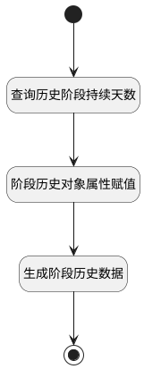

## 商机阶段更新时生成历史 <!-- {docsify-ignore-all} -->

   

### 处理过程




### 处理步骤说明

#### 开始 :id=Begin<sup class="footnote-symbol"> <font color=gray size=1>[开始]</font></sup>


*- N/A*
#### 结束 :id=END1<sup class="footnote-symbol"> <font color=gray size=1>[结束]</font></sup>


*- N/A*

#### 查询历史阶段持续天数 :id=RAWSQLCALL1<sup class="footnote-symbol"> <font color=gray size=1>[直接SQL调用]</font></sup>


<p class="panel-title"><b>执行sql语句</b></p>

```sql
SELECT
	DATEDIFF(SYSDATE(), MAX(t.CREATE_TIME))  AS STAGE_DURATION_CALENDAR_DAYS 
FROM
	deal_history t 
WHERE
	t.deal_id =?;
```

<p class="panel-title"><b>执行sql参数</b></p>

1. `Default(传入变量).ID(标识)`

重置参数`DEAL_HISTORY_STAGE_TIME(商机历史阶段持续时间)`，并将执行sql结果赋值给参数`DEAL_HISTORY_STAGE_TIME(商机历史阶段持续时间)`

#### 阶段历史对象属性赋值 :id=PREPAREPARAM1<sup class="footnote-symbol"> <font color=gray size=1>[准备参数]</font></sup>


1. 将`Default(传入变量).STAGE(阶段标识)` 设置给  `DEAL_HISTORY(商机阶段历史).STAGE(阶段)`
2. 将`Default(传入变量).ID(标识)` 设置给  `DEAL_HISTORY(商机阶段历史).DEAL_ID(商机标识)`
3. 将`Default(传入变量).AMOUNT(金额)` 设置给  `DEAL_HISTORY(商机阶段历史).AMOUNT(金额)`
4. 将`Default(传入变量).PROBABILITY(可能性)` 设置给  `DEAL_HISTORY(商机阶段历史).PROBABILITY(可能性)`
5. 将`Default(传入变量).EXPECTED_REVENUE(预期收益)` 设置给  `DEAL_HISTORY(商机阶段历史).EXPECTED_REVENUE(预期收益)`
6. 将`Default(传入变量).CLOSING_DATE(预计成交日期)` 设置给  `DEAL_HISTORY(商机阶段历史).CLOSING_DATE(预计成交日期)`
7. 将`DEAL_HISTORY_STAGE_TIME(商机历史阶段持续时间).STAGE_DURATION_CALENDAR_DAYS(阶段持续时间(日历天数))` 设置给  `DEAL_HISTORY(商机阶段历史).STAGE_DURATION_CALENDAR_DAYS(阶段持续时间(日历天数))`

#### 生成阶段历史数据 :id=DEACTION1<sup class="footnote-symbol"> <font color=gray size=1>[实体行为]</font></sup>


调用实体 [阶段历史(DEAL_HISTORY)](module/crm/deal_history.md) 行为 [Create](module/crm/deal_history#行为) ，行为参数为`DEAL_HISTORY(商机阶段历史)`


### 实体逻辑参数

|    中文名   |    代码名    |  数据类型    |  实体   |备注 |
| --------| --------| -------- | -------- | --------   |
|传入变量(<i class="fa fa-check"/></i>)|Default|数据对象|[商机(DEAL)](module/crm/deal.md)||
|商机阶段历史|DEAL_HISTORY|数据对象|[阶段历史(DEAL_HISTORY)](module/crm/deal_history.md)||
|商机历史阶段持续时间|DEAL_HISTORY_STAGE_TIME|数据对象|[阶段历史(DEAL_HISTORY)](module/crm/deal_history.md)||
