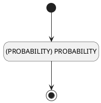

## 可能性(PROBABILITY) <!-- {docsify-ignore-all} -->

   

### 概率 :id=DEFValueRule

#### 条件说明

##### (PROBABILITY) PROBABILITY :id=add3a602d07f99119331c2340570664de

`PROBABILITY(可能性)` 值在区间 `
(-∞ , 100.0]` 内

> [!ATTENTION|label:规则信息|icon:fa fa-warning]
> 概率需要在0%-100%之间

