## 新建线索前加载跟踪人 <!-- {docsify-ignore-all} -->

   

### 处理过程

```plantuml
@startuml
hide empty description
<style>
root {
  HyperlinkColor #42b983
}
</style>

hide empty description
state "开始" as Begin <<start>> [[$./defaultExecutor#begin {"开始"}]]
state "结束" as END1 <<end>> [[$./defaultExecutor#end1 {"结束"}]]
state "默认执行人" as PREPAREPARAM1  [[$./defaultExecutor#prepareparam1 {"默认执行人"}]]
state "准备参数" as PREPAREPARAM2  [[$./defaultExecutor#prepareparam2 {"准备参数"}]]


Begin --> PREPAREPARAM1
PREPAREPARAM1 --> PREPAREPARAM2
PREPAREPARAM2 --> END1


@enduml
```

### 处理步骤说明

#### 开始 :id=Begin [开始]

*- N/A*
#### 结束 :id=END1 [结束]

*- N/A*

#### 默认执行人 :id=PREPAREPARAM1 [准备参数]

1. 将`用户全局对象.userid` 设置给  `item.USER_ID(用户标识)`
2. 将`用户全局对象.srfpersonname` 设置给  `item.name(名称)`
3. 将`item` 追加到  `list.0`

#### 准备参数 :id=PREPAREPARAM2 [准备参数]

1. 将`list` 设置给  `Default(传入变量).EXECUTORS(跟踪人)`

### 实体逻辑参数

|    中文名   |    代码名    |  数据类型    |  实体   |备注 |
| --------| --------| -------- | -------- | --------   |
|传入变量(<i class="fa fa-check"/></i>)|Default|数据对象|[线索(LEAD)](module/crm/lead.md)||
|item|item|数据对象|[执行人(EXECUTOR)](module/crm/executor.md)||
|list|list|数据对象列表|[执行人(EXECUTOR)](module/crm/executor.md)||
