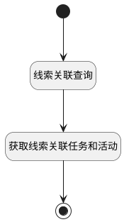

## 获取线索关联任务和活动 <!-- {docsify-ignore-all} -->

   

### 处理过程




### 处理步骤说明

#### 开始 :id=Begin<sup class="footnote-symbol"> <font color=gray size=1>[开始]</font></sup>


*- N/A*
#### 线索关联查询 :id=DEBUGPARAM1<sup class="footnote-symbol"> <font color=gray size=1>[调试逻辑参数]</font></sup>


> [!NOTE|label:调试信息|icon:fa fa-bug]
> 调试输出参数`Default(传入变量)`的详细信息


#### 获取线索关联任务和活动 :id=RAWSQLCALL1<sup class="footnote-symbol"> <font color=gray size=1>[直接SQL调用]</font></sup>


<p class="panel-title"><b>执行sql语句</b></p>

```sql
select t1.`CLOSED_TIME`,
t1.`COST`,
t1.`CREATE_MAN`,
t1.`CREATE_TIME`,
t1.`DESCRIPTION`,
t1.`DUE_DATE`,
DATEDIFF(CURDATE(), t1.`DUE_DATE`) AS `DUE_DATE_SORT`,
t1.`END_TIME`,
t1.`ID`,
t1.`LAST_ASSESS_TIME`,
t1.`LOCKED__S`,
t1.`NAME`,
t1.`OWNER`,
t1.`OWNER_ID`,
t1.`OWNER_NAME`,
t1.`OWNER_SUBTYPE`,
t1.`OWNER_TYPE`,
t1.`PRIORITY`,
t1.`REMIND_AT`,
t1.`SEND_NOTIFICATION_EMAIL`,
t1.`START_TIME`,
t1.`STATUS`,
t1.`SUBJECT`,
t1.`TAG`,
COALESCE(START_TIME, DUE_DATE) AS `TASK_DATE`,
t1.`TYPE`,
t1.`UPDATE_MAN`,
t1.`UPDATE_TIME`
from task t1 
	left join relation t2 ON t1.ID = t2.TARGET_ID 
	left join lead t3 ON t3.ID = t2.PRINCIPAL_ID
where t3.ID = ?
ORDER BY TASK_DATE desc
```

<p class="panel-title"><b>执行sql参数</b></p>

1. `Default(传入变量).principal_id`

重置参数`task_and_maneuver_list(任务活动列表)`，并将执行sql结果赋值给参数`task_and_maneuver_list(任务活动列表)`

#### 结束 :id=END1<sup class="footnote-symbol"> <font color=gray size=1>[结束]</font></sup>


返回 `task_and_maneuver_list(任务活动列表)`


### 实体逻辑参数

|    中文名   |    代码名    |  数据类型    |  实体   |备注 |
| --------| --------| -------- | -------- | --------   |
|传入变量(<i class="fa fa-check"/></i>)|Default|过滤器|||
|任务活动列表|task_and_maneuver_list|数据对象列表|[任务&活动(TASK)](module/crm/task.md)||
