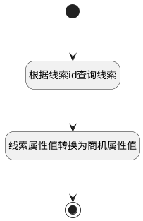

## 派生商机 <!-- {docsify-ignore-all} -->

   

### 处理过程

### 处理步骤说明

#### 开始 :id=Begin [开始]

*- N/A*
#### 根据线索id查询线索 :id=DEACTION2 [实体行为]

调用实体 [线索(LEAD)](module/crm/lead.md) 行为 [Get](module/crm/lead#行为) ，行为参数为`Default(传入变量)`

将执行结果返回给参数`LEADBACK(后台查询返回的线索)`

#### 线索属性值转换为商机属性值 :id=PREPAREPARAM1 [准备参数]

1. 将`LEADBACK(后台查询返回的线索).SUBJECT(主题)` 设置给  `Default(传入变量).DEAL_NAME`
2. 将`LEADBACK(后台查询返回的线索).OWNER(所有者)` 设置给  `Default(传入变量).OWNER(所有者)`
3. 将`LEADBACK(后台查询返回的线索).ACCOUNT_ID(客户标识)` 设置给  `Default(传入变量).ACCOUNT_ID(客户标识)`
4. 将`LEADBACK(后台查询返回的线索).LEAD_SOURCE(线索来源)` 设置给  `Default(传入变量).LEAD_SOURCE(线索来源)`
5. 将`LEADBACK(后台查询返回的线索).DESCRIPTION(描述)` 设置给  `Default(传入变量).DESCRIPTION(描述)`

#### 结束 :id=END1 [结束]

*- N/A*

### 实体逻辑参数

|    中文名   |    代码名    |  数据类型    |  实体   |备注 |
| --------| --------| -------- | -------- | --------   |
|传入变量(<i class="fa fa-check"/></i>)|Default|数据对象|[线索(LEAD)](module/crm/lead.md)||
|后台查询返回的线索|LEADBACK|数据对象|[线索(LEAD)](module/crm/lead.md)||
