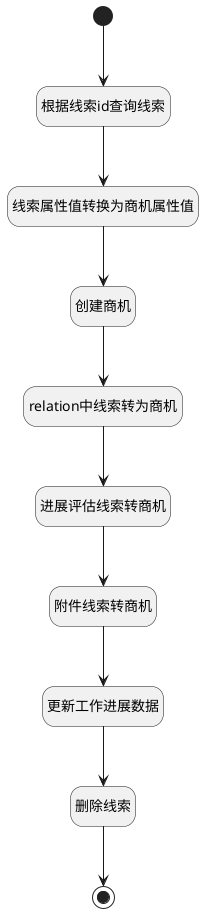

## 线索转商机 <!-- {docsify-ignore-all} -->

   

### 处理过程




### 处理步骤说明

#### 开始 :id=Begin<sup class="footnote-symbol"> <font color=gray size=1>[开始]</font></sup>


*- N/A*
#### 根据线索id查询线索 :id=DEACTION2<sup class="footnote-symbol"> <font color=gray size=1>[实体行为]</font></sup>


调用实体 [线索(LEAD)](module/crm/lead.md) 行为 [Get](module/crm/lead#行为) ，行为参数为`Default(传入变量)`

将执行结果返回给参数`LEADBACK(后台查询返回的线索)`

#### 更新工作进展数据 :id=RAWSQLCALL4<sup class="footnote-symbol"> <font color=gray size=1>[直接SQL调用]</font></sup>


<p class="panel-title"><b>执行sql语句</b></p>

```sql
update work_progress set target_name = CONCAT(target_name,'(由线索转换)'),target_type='DEAL' where target_id = ?
```

<p class="panel-title"><b>执行sql参数</b></p>

1. `Default(传入变量).ID(标识)`


#### 删除线索 :id=DEACTION3<sup class="footnote-symbol"> <font color=gray size=1>[实体行为]</font></sup>


调用实体 [线索(LEAD)](module/crm/lead.md) 行为 [Remove](module/crm/lead#行为) ，行为参数为`LEADBACK(后台查询返回的线索)`

#### 线索属性值转换为商机属性值 :id=PREPAREPARAM1<sup class="footnote-symbol"> <font color=gray size=1>[准备参数]</font></sup>


1. 将`LEADBACK(后台查询返回的线索).SUBJECT(主题)` 设置给  `DEAL(商机).DEAL_NAME(商机名称)`
2. 将`10` 设置给  `DEAL(商机).STAGE(阶段标识)`
3. 将`LEADBACK(后台查询返回的线索).ID(标识)` 设置给  `DEAL(商机).ID(标识)`
4. 将`LEADBACK(后台查询返回的线索).OWNER(所有者)` 设置给  `DEAL(商机).OWNER(所有者)`
5. 将`LEADBACK(后台查询返回的线索).ACCOUNT_ID(客户标识)` 设置给  `DEAL(商机).ACCOUNT_ID(客户ID)`
6. 将`LEADBACK(后台查询返回的线索).LEAD_SOURCE(线索来源)` 设置给  `DEAL(商机).LEAD_SOURCE(线索来源)`
7. 将`LEADBACK(后台查询返回的线索).DESCRIPTION(描述)` 设置给  `DEAL(商机).DESCRIPTION(描述)`

#### 附件线索转商机 :id=RAWSQLCALL3<sup class="footnote-symbol"> <font color=gray size=1>[直接SQL调用]</font></sup>


<p class="panel-title"><b>执行sql语句</b></p>

```sql
update attachment t set t.OWNER_ID=?,t.OWNER_TYPE='DEAL'
where t.OWNER_ID= ?
```

<p class="panel-title"><b>执行sql参数</b></p>

1. `DEAL(商机).ID(标识)`
2. `LEADBACK(后台查询返回的线索).ID(标识)`


#### 结束 :id=END1<sup class="footnote-symbol"> <font color=gray size=1>[结束]</font></sup>


*- N/A*

#### 创建商机 :id=DEACTION1<sup class="footnote-symbol"> <font color=gray size=1>[实体行为]</font></sup>


调用实体 [商机(DEAL)](module/crm/deal.md) 行为 [Create](module/crm/deal#行为) ，行为参数为`DEAL(商机)`

将执行结果返回给参数`DEAL(商机)`

#### relation中线索转为商机 :id=RAWSQLCALL1<sup class="footnote-symbol"> <font color=gray size=1>[直接SQL调用]</font></sup>

关系界面中,relation线索id转为商机id,包括：
1.待办任务
2.已完成的任务&历史活动
3.关联商品


<p class="panel-title"><b>执行sql语句</b></p>

```sql
update relation t set t.PRINCIPAL_ID=? ,t.PRINCIPAL_TYPE='DEAL' 
 where t.PRINCIPAL_ID= ?
```

<p class="panel-title"><b>执行sql参数</b></p>

1. `DEAL(商机).ID(标识)`
2. `LEADBACK(后台查询返回的线索).ID(标识)`


#### 进展评估线索转商机 :id=RAWSQLCALL2<sup class="footnote-symbol"> <font color=gray size=1>[直接SQL调用]</font></sup>

进展评估中线索id转成商机id

<p class="panel-title"><b>执行sql语句</b></p>

```sql
update note_attach t set t.PRINCIPAL_ID=?
,t.OWNER_TYPE='DEAL',t.PRINCIPAL_TYPE='DEAL'  
 where t.PRINCIPAL_ID= ?
```

<p class="panel-title"><b>执行sql参数</b></p>

1. `DEAL(商机).ID(标识)`
2. `LEADBACK(后台查询返回的线索).ID(标识)`


### 实体逻辑参数

|    中文名   |    代码名    |  数据类型    |  实体   |备注 |
| --------| --------| -------- | -------- | --------   |
|传入变量(<i class="fa fa-check"/></i>)|Default|数据对象|[线索(LEAD)](module/crm/lead.md)||
|商机|DEAL|数据对象|[商机(DEAL)](module/crm/deal.md)|新建商机|
|后台查询返回的线索|LEADBACK|数据对象|[线索(LEAD)](module/crm/lead.md)||
