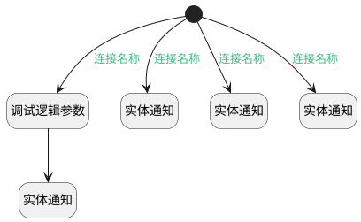

## 新建、更新进展评估后通知 <!-- {docsify-ignore-all} -->

   

### 处理过程

### 处理步骤说明

#### 开始 :id=Begin [开始]

*- N/A*
#### 调试逻辑参数 :id=DEBUGPARAM1 [调试逻辑参数]

> [!NOTE|label:调试信息|icon:fa fa-bug]
> 调试输出参数`Default(传入变量)`的详细信息

#### 实体通知 :id=DENOTIFY1 [实体通知]

调用实体 [备注(NOTE_ATTACH)](module/crm/note_attach.md) 通知 [订单进展评估通知(progress_assess_notify)](module/crm/note_attach/notify/progress_assess_notify) ，参数为`Default(传入变量)`
#### 实体通知 :id=DENOTIFY2 [实体通知]

调用实体 [备注(NOTE_ATTACH)](module/crm/note_attach.md) 通知 [任务进展评估通知(taskNotify)](module/crm/note_attach/notify/taskNotify) ，参数为`Default(传入变量)`
#### 实体通知 :id=DENOTIFY3 [实体通知]

调用实体 [备注(NOTE_ATTACH)](module/crm/note_attach.md) 通知 [线索进展评估通知(LeadNotify)](module/crm/note_attach/notify/LeadNotify) ，参数为`Default(传入变量)`
#### 实体通知 :id=DENOTIFY4 [实体通知]

调用实体 [备注(NOTE_ATTACH)](module/crm/note_attach.md) 通知 [商机进展评估通知(dealNotify)](module/crm/note_attach/notify/dealNotify) ，参数为`Default(传入变量)`

### 连接条件说明
#### 连接名称 :id=Begin-DENOTIFY1

`Default(传入变量).PRINCIPAL_TYPE(备注主体类型)` EQ `PROJECT`
#### 连接名称 :id=Begin-DEBUGPARAM1

`Default(传入变量).PRINCIPAL_TYPE(备注主体类型)` EQ `DEAL`
#### 连接名称 :id=Begin-DENOTIFY2

`Default(传入变量).PRINCIPAL_TYPE(备注主体类型)` EQ `TASK`
#### 连接名称 :id=Begin-DENOTIFY3

`Default(传入变量).PRINCIPAL_TYPE(备注主体类型)` EQ `LEAD`

### 实体逻辑参数

|    中文名   |    代码名    |  数据类型    |  实体   |备注 |
| --------| --------| -------- | -------- | --------   |
|传入变量(<i class="fa fa-check"/></i>)|Default|数据对象|[备注(NOTE_ATTACH)](module/crm/note_attach.md)||
