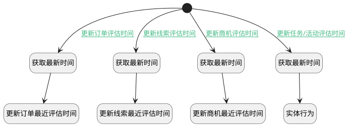

## 更新最近评估时间 <!-- {docsify-ignore-all} -->

   

### 处理过程

### 处理步骤说明

#### 开始 :id=Begin [开始]

*- N/A*
#### 获取最新时间 :id=PREPAREPARAM1 [准备参数]

1. 将`Default(传入变量).CREATE_TIME(建立时间)` 设置给  `PROJECT(计划实体).LAST_ASSESS_TIME(最近评估时间)`
2. 将`Default(传入变量).PRINCIPAL_ID(备注主体标识)` 设置给  `PROJECT(计划实体).ID(标识)`

#### 获取最新时间 :id=PREPAREPARAM2 [准备参数]

1. 将`Default(传入变量).PRINCIPAL_ID(备注主体标识)` 设置给  `LEAD(线索实体).ID(标识)`
2. 将`Default(传入变量).CREATE_TIME(建立时间)` 设置给  `LEAD(线索实体).LAST_ASSESS_TIME(最近评估时间)`

#### 获取最新时间 :id=PREPAREPARAM3 [准备参数]

1. 将`Default(传入变量).PRINCIPAL_ID(备注主体标识)` 设置给  `DEAL(商机实体).ID(标识)`
2. 将`Default(传入变量).CREATE_TIME(建立时间)` 设置给  `DEAL(商机实体).LAST_ASSESS_TIME(最近评估时间)`

#### 获取最新时间 :id=PREPAREPARAM4 [准备参数]

1. 将`Default(传入变量).CREATE_TIME(建立时间)` 设置给  `TASK(任务/活动实体).LAST_ASSESS_TIME(最近评估时间)`
2. 将`Default(传入变量).PRINCIPAL_ID(备注主体标识)` 设置给  `TASK(任务/活动实体).ID(标识)`

#### 更新订单最近评估时间 :id=DEACTION1 [实体行为]

调用实体 [订单(PROJECT)](module/crm/project.md) 行为 [Update](module/crm/project#行为) ，行为参数为`PROJECT(计划实体)`

#### 更新线索最近评估时间 :id=DEACTION2 [实体行为]

调用实体 [线索(LEAD)](module/crm/lead.md) 行为 [Update](module/crm/lead#行为) ，行为参数为`LEAD(线索实体)`

#### 更新商机最近评估时间 :id=DEACTION3 [实体行为]

调用实体 [商机(DEAL)](module/crm/deal.md) 行为 [Update](module/crm/deal#行为) ，行为参数为`DEAL(商机实体)`

#### 实体行为 :id=DEACTION4 [实体行为]

调用实体 [任务&活动(TASK)](module/crm/task.md) 行为 [Update](module/crm/task#行为) ，行为参数为`TASK(任务/活动实体)`

### 连接条件说明
#### 更新订单评估时间 :id=Begin-PREPAREPARAM1

`Default(传入变量).PRINCIPAL_TYPE(备注主体类型)` EQ `PROJECT`
#### 更新线索评估时间 :id=Begin-PREPAREPARAM2

`Default(传入变量).OWNER_TYPE(所属数据对象)` EQ `LEAD`
#### 更新商机评估时间 :id=Begin-PREPAREPARAM3

`Default(传入变量).PRINCIPAL_TYPE(备注主体类型)` EQ `DEAL`
#### 更新任务/活动评估时间 :id=Begin-PREPAREPARAM4

`Default(传入变量).PRINCIPAL_TYPE(备注主体类型)` EQ `TASK`

### 实体逻辑参数

|    中文名   |    代码名    |  数据类型    |  实体   |备注 |
| --------| --------| -------- | -------- | --------   |
|传入变量(<i class="fa fa-check"/></i>)|Default|数据对象|[备注(NOTE_ATTACH)](module/crm/note_attach.md)||
|商机实体|DEAL|数据对象|[商机(DEAL)](module/crm/deal.md)||
|线索实体|LEAD|数据对象|[线索(LEAD)](module/crm/lead.md)||
|计划实体|PROJECT|数据对象|[订单(PROJECT)](module/crm/project.md)||
|任务/活动实体|TASK|数据对象|[任务&活动(TASK)](module/crm/task.md)||
