## 新建收款记录添加到工作进展 <!-- {docsify-ignore-all} -->

   

### 处理过程

```plantuml
@startuml
hide empty description
<style>
root {
  HyperlinkColor #42b983
}
</style>

hide empty description
state "开始" as Begin <<start>> [[$./addPayeeToWorkProgress#begin {"开始"}]]
state "结束" as END1 <<end>> [[$./addPayeeToWorkProgress#end1 {"结束"}]]
state "准备工作进展参数" as PREPAREPARAM1  [[$./addPayeeToWorkProgress#prepareparam1 {"准备工作进展参数"}]]
state "创建工作进展" as DEACTION1  [[$./addPayeeToWorkProgress#deaction1 {"创建工作进展"}]]


Begin --> PREPAREPARAM1
PREPAREPARAM1 --> DEACTION1
DEACTION1 --> END1


@enduml
```

### 处理步骤说明

#### 开始 :id=Begin [开始]

*- N/A*
#### 结束 :id=END1 [结束]

*- N/A*

#### 准备工作进展参数 :id=PREPAREPARAM1 [准备参数]

1. 将`create` 设置给  `WORK_PROGRESS(工作进展).ACTIONTYPE(操作类型)`
2. 将`Default(传入变量).ID(标识)` 设置给  `WORK_PROGRESS(工作进展).TARGET_ID(关联目标标识)`
3. 将`PAYEE` 设置给  `WORK_PROGRESS(工作进展).TARGET_TYPE(关联目标类型)`
4. 将`Default(传入变量).PROJECT_NAME(订单名称)` 设置给  `WORK_PROGRESS(工作进展).TARGET_NAME(关联目标名称)`
5. 将`Default(传入变量).DESCRIPTION(款项说明)` 设置给  `WORK_PROGRESS(工作进展).DESCRIPTION(描述)`

#### 创建工作进展 :id=DEACTION1 [实体行为]

调用实体 [工作进展(WORK_PROGRESS)](module/crm/work_progress.md) 行为 [Create](module/crm/work_progress#行为) ，行为参数为`WORK_PROGRESS(工作进展)`

### 实体逻辑参数

|    中文名   |    代码名    |  数据类型    |  实体   |备注 |
| --------| --------| -------- | -------- | --------   |
|传入变量(<i class="fa fa-check"/></i>)|Default|数据对象|[收款记录(PAYEE)](module/crm/payee.md)||
|工作进展|WORK_PROGRESS|数据对象|[工作进展(WORK_PROGRESS)](module/crm/work_progress.md)||
