## 传递订单id给向导视图 <!-- {docsify-ignore-all} -->

   传递订单id给向导视图

### 处理过程

```plantuml
@startuml
hide empty description
<style>
root {
  HyperlinkColor #42b983
}
</style>

hide empty description
state "开始" as Begin <<start>> [[$./get_project_id#begin {"开始"}]]
state "结束" as END1 <<end>> [[$./get_project_id#end1 {"结束"}]]
state "准备参数" as PREPAREPARAM1  [[$./get_project_id#prepareparam1 {"准备参数"}]]


Begin --> PREPAREPARAM1
PREPAREPARAM1 --> END1


@enduml
```

### 处理步骤说明

#### 开始 :id=Begin [开始]

*- N/A*
#### 结束 :id=END1 [结束]

返回 `Default(传入变量)`

#### 准备参数 :id=PREPAREPARAM1 [准备参数]

1. 将`当前视图参数[project] ==> Default[PROJECT_ID]` 设置给  `Default(传入变量).PROJECT_ID(订单标识)`

### 实体逻辑参数

|    中文名   |    代码名    |  数据类型    |  实体   |备注 |
| --------| --------| -------- | -------- | --------   |
|传入变量(<i class="fa fa-check"/></i>)|Default|数据对象|[收款记录(PAYEE)](module/crm/payee.md)||
