## 获取对应记录信息 <!-- {docsify-ignore-all} -->

   获取记录信息回填到表单中

### 处理过程

```plantuml
@startuml
hide empty description
<style>
root {
  HyperlinkColor #42b983
}
</style>

hide empty description
state "开始" as Begin <<start>> [[$./plan_account_get#begin {"开始"}]]
state "结束" as END1 <<end>> [[$./plan_account_get#end1 {"结束"}]]
state "准备参数" as PREPAREPARAM1  [[$./plan_account_get#prepareparam1 {"准备参数"}]]
state "实体行为" as DEACTION1  [[$./plan_account_get#deaction1 {"实体行为"}]]
state "调试逻辑参数" as DEBUGPARAM1  [[$./plan_account_get#debugparam1 {"调试逻辑参数"}]]
state "准备参数" as PREPAREPARAM2  [[$./plan_account_get#prepareparam2 {"准备参数"}]]


Begin --> PREPAREPARAM1 : [[$./plan_account_get#begin-prepareparam1{连接名称} 连接名称]]
PREPAREPARAM1 --> DEACTION1
DEACTION1 --> DEBUGPARAM1
DEBUGPARAM1 --> PREPAREPARAM2
PREPAREPARAM2 --> END1


@enduml
```

### 处理步骤说明

#### 结束 :id=END1 [结束]

返回 `Default(传入变量)`

#### 开始 :id=Begin [开始]

*- N/A*
#### 准备参数 :id=PREPAREPARAM1 [准备参数]

1. 将`Default(传入变量).PAYEE_PLAN_ID(收款计划标识)` 设置给  `payee_plan(收款计划).ID(标识)`

#### 实体行为 :id=DEACTION1 [实体行为]

调用实体 [收款计划(PAYEE_PLAN)](module/crm/payee_plan.md) 行为 [Get](module/crm/payee_plan#行为) ，行为参数为`payee_plan(收款计划)`

将执行结果返回给参数`payee_plan(收款计划)`

#### 调试逻辑参数 :id=DEBUGPARAM1 [调试逻辑参数]

> [!NOTE|label:调试信息|icon:fa fa-bug]
> 调试输出参数`payee_plan(收款计划)`的详细信息

#### 准备参数 :id=PREPAREPARAM2 [准备参数]

1. 将`payee_plan(收款计划).AMOUNT(金额)` 设置给  `Default(传入变量).PLAN_AMOUNT(原计划金额)`
2. 将`payee_plan(收款计划).PLANNED_TIME(计划收款时间)` 设置给  `Default(传入变量).PLANNED_TIME(原计划时间)`
3. 将`payee_plan(收款计划).DESCRIPTION(款项说明)` 设置给  `Default(传入变量).PLAN_DESCRIPTION(原计划说明)`

### 连接条件说明
#### 连接名称 :id=Begin-PREPAREPARAM1

`Default(传入变量).PAYEE_PLAN_ID(收款计划标识)` ISNOTNULL

### 实体逻辑参数

|    中文名   |    代码名    |  数据类型    |  实体   |备注 |
| --------| --------| -------- | -------- | --------   |
|传入变量(<i class="fa fa-check"/></i>)|Default|数据对象|[收款记录(PAYEE)](module/crm/payee.md)||
|收款计划|payee_plan|数据对象|[收款计划(PAYEE_PLAN)](module/crm/payee_plan.md)||
