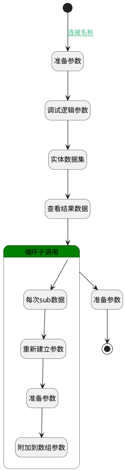

## 将订单分配传入收款记录 <!-- {docsify-ignore-all} -->

   

### 处理过程




### 处理步骤说明

#### 准备参数 :id=PREPAREPARAM2<sup class="footnote-symbol"> <font color=gray size=1>[准备参数]</font></sup>


1. 将`空值（NULL）` 设置给  `PAYEE_ALLOCATE(记录分配人员).ID(标识)`
2. 将`sub(循环用临时变量).RATIO(分配比率)` 设置给  `PAYEE_ALLOCATE(记录分配人员).RATIO(分配比率)`
3. 将`sub(循环用临时变量).USER_ID(用户标识)` 设置给  `PAYEE_ALLOCATE(记录分配人员).USER_ID(用户标识)`

#### 附加到数组参数 :id=APPENDPARAM1<sup class="footnote-symbol"> <font color=gray size=1>[附加到数组参数]</font></sup>


将参数`PAYEE_ALLOCATE(记录分配人员)` 添加到数组参数`PAYEE_ALLOCATES(用户实体)`
#### 重新建立参数 :id=RENEWPARAM1<sup class="footnote-symbol"> <font color=gray size=1>[重新建立参数]</font></sup>


重建参数```PAYEE_ALLOCATE(记录分配人员)```
#### 结束 :id=END1<sup class="footnote-symbol"> <font color=gray size=1>[结束]</font></sup>


返回 `Default(传入变量)`

#### 每次sub数据 :id=DEBUGPARAM4<sup class="footnote-symbol"> <font color=gray size=1>[调试逻辑参数]</font></sup>


> [!NOTE|label:调试信息|icon:fa fa-bug]
> 调试输出参数`sub(循环用临时变量)`的详细信息


#### 循环子调用 :id=LOOPSUBCALL1<sup class="footnote-symbol"> <font color=gray size=1>[循环子调用]</font></sup>


循环参数`ORDER_ALLOCATES(订单分配)`，子循环参数使用`sub(循环用临时变量)`
#### 准备参数 :id=PREPAREPARAM3<sup class="footnote-symbol"> <font color=gray size=1>[准备参数]</font></sup>


1. 将`PAYEE_ALLOCATES(用户实体)` 设置给  `Default(传入变量).PAYEE_ALLOCATES(回款分配)`

#### 查看结果数据 :id=DEBUGPARAM3<sup class="footnote-symbol"> <font color=gray size=1>[调试逻辑参数]</font></sup>


> [!NOTE|label:调试信息|icon:fa fa-bug]
> 调试输出参数`ORDER_ALLOCATES(订单分配)`的详细信息


#### 实体数据集 :id=DEDATASET1<sup class="footnote-symbol"> <font color=gray size=1>[实体数据集]</font></sup>


调用实体 [订单分配(ORDER_ALLOCATE)](module/crm/order_allocate.md) 数据集合 [数据集(DEFAULT)](module/crm/order_allocate#数据集合) ，查询参数为`order_allocate_filter(ORDER_ALLOCATE的owner_id过滤)`

将执行结果返回给参数`ORDER_ALLOCATES(订单分配)`

#### 调试逻辑参数 :id=DEBUGPARAM2<sup class="footnote-symbol"> <font color=gray size=1>[调试逻辑参数]</font></sup>


> [!NOTE|label:调试信息|icon:fa fa-bug]
> 调试输出参数`Default(传入变量)`的详细信息


#### 开始 :id=Begin<sup class="footnote-symbol"> <font color=gray size=1>[开始]</font></sup>


*- N/A*
#### 准备参数 :id=PREPAREPARAM1<sup class="footnote-symbol"> <font color=gray size=1>[准备参数]</font></sup>


1. 将`Default(传入变量).project_id(订单标识)` 设置给  `order_allocate_filter(ORDER_ALLOCATE的owner_id过滤).n_owner_id_eq`


### 连接条件说明
#### 连接名称 :id=Begin-PREPAREPARAM1

`Default(传入变量).PROJECT_ID(订单标识)` ISNOTNULL


### 实体逻辑参数

|    中文名   |    代码名    |  数据类型    |  实体   |备注 |
| --------| --------| -------- | -------- | --------   |
|传入变量(<i class="fa fa-check"/></i>)|Default|数据对象|[收款记录(PAYEE)](module/crm/payee.md)||
|订单关系数据|ORDER_ALLOCATE|数据对象|[订单分配(ORDER_ALLOCATE)](module/crm/order_allocate.md)||
|订单分配|ORDER_ALLOCATES|分页查询|||
|记录分配人员|PAYEE_ALLOCATE|数据对象|[回款分配(PAYEE_ALLOCATE)](module/crm/payee_allocate.md)||
|用户实体|PAYEE_ALLOCATES|数据对象列表|[回款分配(PAYEE_ALLOCATE)](module/crm/payee_allocate.md)||
|ORDER_ALLOCATE的owner_id过滤|order_allocate_filter|过滤器|||
|循环用临时变量|sub|数据对象|[订单分配(ORDER_ALLOCATE)](module/crm/order_allocate.md)||
