## 收款记录保存之前 <!-- {docsify-ignore-all} -->

   从收款计划->新建收款记录时：判断收款记录金额若小于计划金额时，弹出提示

### 处理过程

```plantuml
@startuml
hide footbox
<style>
root {
  HyperlinkColor #42b983
}
</style>

hide empty description
state "开始" as Begin <<start>> [[$./before_save_payee#begin {开始}]]
state "绑定表单数据对象" as PREPAREJSPARAM1  [[$./before_save_payee#preparejsparam1 {绑定表单数据对象}]]
state "判断金额，是否提示" as RAWJSCODE1  [[$./before_save_payee#rawjscode1 {判断金额，是否提示}]]


Begin --> PREPAREJSPARAM1
PREPAREJSPARAM1 --> RAWJSCODE1


@enduml
```




### 处理步骤说明

#### 开始 :id=Begin<sup class="footnote-symbol"> <font color=gray size=1>[开始]</font></sup>


#### 绑定表单数据对象 :id=PREPAREJSPARAM1<sup class="footnote-symbol"> <font color=gray size=1>[准备参数]</font></sup>


1. 将`view(当前视图对象).layoutPanel.panelItems.form.control.data` 设置给  `form_data(表单数据对象)`

#### 判断金额，是否提示 :id=RAWJSCODE1<sup class="footnote-symbol"> <font color=gray size=1>[直接前台代码]</font></sup>


<p class="panel-title"><b>执行代码</b></p>

```javascript
var form_data = view.layoutPanel.panelItems.form.control.data;
var planned_amount = form_data.planned_amount; // 收款计划金额 
var amount = form_data.amount; // 收款记录金额 
if (planned_amount != undefined  && planned_amount != null) {
    if( amount < planned_amount ){
        util.message.warning('收款金额小于计划金额，请降低原收款计划金额！');
    }
}
```


### 实体逻辑参数

|    中文名   |    代码名    |  数据类型      |备注 |
| --------| --------| --------  | --------   |
|当前部件对象|ctrl|当前部件对象||
|当前视图对象|view|当前视图对象||
|表单数据对象|form_data|数据对象||
|传入变量(<i class="fa fa-check"/></i>)|Default|数据对象||
