## 将订单数据传给计划 <!-- {docsify-ignore-all} -->

   获取订单的数据并赋给计划展示

### 处理过程

```plantuml
@startuml
hide empty description
<style>
root {
  HyperlinkColor #42b983
}
</style>

hide empty description
state "开始" as Begin <<start>> [[$./dateFromProject#begin {"开始"}]]
state "准备参数" as PREPAREPARAM1  [[$./dateFromProject#prepareparam1 {"准备参数"}]]
state "实体行为" as DEACTION1  [[$./dateFromProject#deaction1 {"实体行为"}]]
state "准备参数" as PREPAREPARAM2  [[$./dateFromProject#prepareparam2 {"准备参数"}]]
state "结束" as END1 <<end>> [[$./dateFromProject#end1 {"结束"}]]


Begin --> PREPAREPARAM1
PREPAREPARAM1 --> DEACTION1
DEACTION1 --> PREPAREPARAM2
PREPAREPARAM2 --> END1


@enduml
```

### 处理步骤说明

#### 开始 :id=Begin [开始]

*- N/A*
#### 准备参数 :id=PREPAREPARAM1 [准备参数]

1. 将`Default(传入变量).PROJECT_ID(订单名称)` 设置给  `PROJECT(订单数据).ID(标识)`

#### 实体行为 :id=DEACTION1 [实体行为]

调用实体 [订单(PROJECT)](module/crm/project.md) 行为 [Get](module/crm/project#行为) ，行为参数为`PROJECT(订单数据)`

将执行结果返回给参数`PROJECT(订单数据)`

#### 准备参数 :id=PREPAREPARAM2 [准备参数]

1. 将`PROJECT(订单数据).BUSINESS_LINE(业务条线)` 设置给  `Default(传入变量).O_NUMBER(订单编号)`
2. 将`PROJECT(订单数据).BUSINESS_LINE(业务条线)` 设置给  `Default(传入变量).BUSINESS_LINE(业务条线)`
3. 将`PROJECT(订单数据).SETTLEMENT_AMOUNT(业绩结算金额)` 设置给  `Default(传入变量).SETTLEMENT_AMOUNT(业绩结算金额)`
4. 将`PROJECT(订单数据).ACCOUNT_NAME(客户名称)` 设置给  `Default(传入变量).ACCOUNT_NAME(订单客户)`
5. 将`PROJECT(订单数据).ORDER_DATE(订单日期)` 设置给  `Default(传入变量).ORDER_DATE(订单日期)`

#### 结束 :id=END1 [结束]

返回 `Default(传入变量)`

### 实体逻辑参数

|    中文名   |    代码名    |  数据类型    |  实体   |备注 |
| --------| --------| -------- | -------- | --------   |
|传入变量(<i class="fa fa-check"/></i>)|Default|数据对象|[收款计划(PAYEE_PLAN)](module/crm/payee_plan.md)||
|订单数据|PROJECT|数据对象|[订单(PROJECT)](module/crm/project.md)||
