## 将数据传给记录 <!-- {docsify-ignore-all} -->

   将计划数据（金额、描述等）传给记录

### 处理过程

```plantuml
@startuml
hide empty description
<style>
root {
  HyperlinkColor #42b983
}
</style>

hide empty description
state "开始" as Begin <<start>> [[$./plan_to_payee#begin {"开始"}]]
state "结束" as END1 <<end>> [[$./plan_to_payee#end1 {"结束"}]]
state "实体行为" as DEACTION1  [[$./plan_to_payee#deaction1 {"实体行为"}]]
state "将所需数据" as PREPAREPARAM1  [[$./plan_to_payee#prepareparam1 {"将所需数据"}]]


Begin --> DEACTION1
DEACTION1 --> PREPAREPARAM1
PREPAREPARAM1 --> END1


@enduml
```

### 处理步骤说明

#### 开始 :id=Begin [开始]

*- N/A*
#### 结束 :id=END1 [结束]

返回 `payee(收款记录)`

#### 实体行为 :id=DEACTION1 [实体行为]

调用实体 [收款计划(PAYEE_PLAN)](module/crm/payee_plan.md) 行为 [Get](module/crm/payee_plan#行为) ，行为参数为`Default(传入变量)`

将执行结果返回给参数`Default(传入变量)`

#### 将所需数据 :id=PREPAREPARAM1 [准备参数]

1. 将`Default(传入变量).DESCRIPTION(款项说明)` 设置给  `payee(收款记录).PLAN_DESCRIPTION(原计划说明)`
2. 将`Default(传入变量).AMOUNT(金额)` 设置给  `payee(收款记录).PLAN_AMOUNT(原计划金额)`

### 实体逻辑参数

|    中文名   |    代码名    |  数据类型    |  实体   |备注 |
| --------| --------| -------- | -------- | --------   |
|传入变量(<i class="fa fa-check"/></i>)|Default|数据对象|[收款计划(PAYEE_PLAN)](module/crm/payee_plan.md)||
|收款记录|payee|数据对象|[收款记录(PAYEE)](module/crm/payee.md)||
