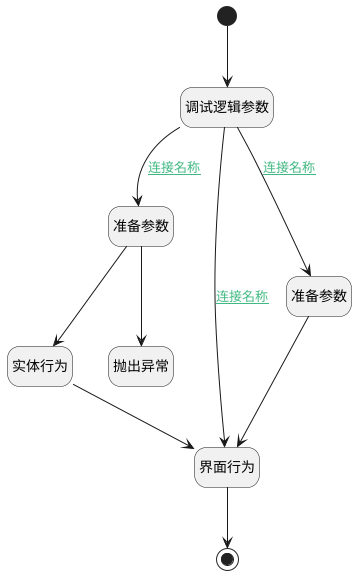

## 拆分前保存检测 <!-- {docsify-ignore-all} -->

   拆分订单时上一订单减掉新订单的金额

### 处理过程




### 处理步骤说明

#### 开始 :id=Begin<sup class="footnote-symbol"> <font color=gray size=1>[开始]</font></sup>


#### 抛出异常 :id=THROWEXCEPTION1<sup class="footnote-symbol"> <font color=gray size=1>[抛出异常]</font></sup>


> [!ATTENTION|label:抛出异常|icon:fa fa-warning]
> 错误信息：金额大于上一记录的金额

#### 调试逻辑参数 :id=DEBUGPARAM1<sup class="footnote-symbol"> <font color=gray size=1>[调试逻辑参数]</font></sup>


> [!NOTE|label:调试信息|icon:fa fa-bug]
> 调试输出参数`传入变量`的详细信息

#### 准备参数 :id=PREPAREJSPARAM2<sup class="footnote-symbol"> <font color=gray size=1>[准备参数]</font></sup>


1. 将`Default(传入变量).last_result_amount` 设置给  `last_plan(上一计划参数).amount`
2. 将`Default(传入变量).last_id` 设置给  `last_plan(上一计划参数).id`

#### 准备参数 :id=PREPAREJSPARAM3<sup class="footnote-symbol"> <font color=gray size=1>[准备参数]</font></sup>


1. 将`10` 设置给  `Default(传入变量).plan_status`

#### 界面行为 :id=DEUIACTION1<sup class="footnote-symbol"> <font color=gray size=1>[实体界面行为调用]</font></sup>


调用实体 [收款计划(PAYEE_PLAN)](module/crm/payee_plan.md) 界面行为 [编辑界面_保存操作](module/crm/payee_plan#界面行为) ，行为参数为`Default(传入变量)`

#### 实体行为 :id=DEACTION1<sup class="footnote-symbol"> <font color=gray size=1>[实体行为]</font></sup>


调用实体 [收款计划(PAYEE_PLAN)](module/crm/payee_plan.md) 行为 [Save](module/crm/payee_plan#行为) ，行为参数为`last_plan(上一计划参数)`

#### 结束 :id=END1<sup class="footnote-symbol"> <font color=gray size=1>[结束]</font></sup>


### 连接条件说明
#### 连接名称 :id=DEBUGPARAM1-PREPAREJSPARAM3

```Default(传入变量).view_mode``` NOTEQ ```cut``` AND ```Default(传入变量).plan_status``` ISNULL
#### 连接名称 :id=DEBUGPARAM1-PREPAREJSPARAM2

```Default(传入变量).view_mode``` EQ ```cut```
#### 连接名称 


#### 连接名称 


#### 连接名称 :id=DEBUGPARAM1-DEUIACTION1

```Default(传入变量).view_mode``` NOTEQ ```cut``` AND ```Default(传入变量).plan_status``` ISNOTNULL


### 实体逻辑参数

|    中文名   |    代码名    |  数据类型      |备注 |
| --------| --------| --------  | --------   |
|上一计划参数|last_plan|数据对象|上一订单属性|
|传入变量(<i class="fa fa-check"/></i>)|Default|数据对象||
