## 计算统计数据 <!-- {docsify-ignore-all} -->

   

### 处理过程

```plantuml
@startuml
hide empty description
<style>
root {
  HyperlinkColor #42b983
}
</style>

hide empty description
state "开始" as Begin <<start>> [[$./Calculation#begin {"开始"}]]
state "删除已有数据" as RAWSQLCALL1  [[$./Calculation#rawsqlcall1 {"删除已有数据"}]]
state "计算统计数据" as RAWSQLCALL2  [[$./Calculation#rawsqlcall2 {"计算统计数据"}]]
state "结束" as END1 <<end>> [[$./Calculation#end1 {"结束"}]]


Begin --> RAWSQLCALL1
RAWSQLCALL1 --> RAWSQLCALL2
RAWSQLCALL2 --> END1


@enduml
```




### 处理步骤说明

#### 开始 :id=Begin<sup class="footnote-symbol"> <font color=gray size=1>[开始]</font></sup>


*- N/A*
#### 删除已有数据 :id=RAWSQLCALL1<sup class="footnote-symbol"> <font color=gray size=1>[直接SQL调用]</font></sup>


<p class="panel-title"><b>执行sql语句</b></p>

```sql
DELETE FROM PAYEE_STATISTIC;
```


#### 计算统计数据 :id=RAWSQLCALL2<sup class="footnote-symbol"> <font color=gray size=1>[直接SQL调用]</font></sup>


<p class="panel-title"><b>执行sql语句</b></p>

```sql
INSERT INTO PAYEE_STATISTIC(ID,AMOUNT,NAME,TYPE,OWNER,STATISTIC_DATE,BUSINESS_LINE)
SELECT UUID(),SUM(T1.AMOUNT),CASE WHEN T1.PLANNED_TIME IS NOT NULL THEN CONCAT(YEAR(T1.PLANNED_TIME),'-',LPAD(MONTH(T1.PLANNED_TIME), 2, '0')) ELSE '未明确' END,CASE WHEN T1.PLANNED_TIME IS NULL THEN 0 ELSE 2 END,T2.OWNER,STR_TO_DATE(CONCAT(YEAR(T1.PLANNED_TIME),'-',LPAD(MONTH(T1.PLANNED_TIME), 2, '0'),'-01'), '%Y-%m-%d'),T2.BUSINESS_LINE FROM PAYEE_PLAN T1,PROJECT T2
WHERE T1.PROJECT_ID = T2.ID AND T1.PLAN_STATUS = '10' 
GROUP BY T2.OWNER,T2.BUSINESS_LINE,YEAR(T1.PLANNED_TIME),MONTH(T1.PLANNED_TIME)
UNION ALL
SELECT UUID(),SUM(T1.AMOUNT),CONCAT(YEAR(T1.PAYEE_DATE),'-',LPAD(MONTH(T1.PAYEE_DATE), 2, '0')),'1',T2.OWNER,STR_TO_DATE(CONCAT(YEAR(T1.PAYEE_DATE),'-',LPAD(MONTH(T1.PAYEE_DATE), 2, '0'),'-01'), '%Y-%m-%d'),T2.BUSINESS_LINE FROM PAYEE T1,PROJECT T2
WHERE T1.PROJECT_ID = T2.ID
GROUP BY T2.OWNER,T2.BUSINESS_LINE,YEAR(T1.PAYEE_DATE),MONTH(T1.PAYEE_DATE)
```


#### 结束 :id=END1<sup class="footnote-symbol"> <font color=gray size=1>[结束]</font></sup>


返回 `无值（NONE）`


### 实体逻辑参数

|    中文名   |    代码名    |  数据类型    |  实体   |备注 |
| --------| --------| -------- | -------- | --------   |
|传入变量(<i class="fa fa-check"/></i>)|Default|数据对象|[收款情况统计(PAYEE_STATISTIC)](module/crm/payee_statistic.md)||
