## 清空收款计划表 <!-- {docsify-ignore-all} -->

   

### 处理过程

```plantuml
@startuml
hide empty description
<style>
root {
  HyperlinkColor #42b983
}
</style>

hide empty description
state "开始" as Begin <<start>> [[$./delete_statistic#begin {"开始"}]]
state "结束" as END1 <<end>> [[$./delete_statistic#end1 {"结束"}]]
state "直接SQL调用" as RAWSQLCALL1  [[$./delete_statistic#rawsqlcall1 {"直接SQL调用"}]]


Begin --> RAWSQLCALL1
RAWSQLCALL1 --> END1


@enduml
```




### 处理步骤说明

#### 结束 :id=END1<sup class="footnote-symbol"> <font color=gray size=1>[结束]</font></sup>


*- N/A*

#### 直接SQL调用 :id=RAWSQLCALL1<sup class="footnote-symbol"> <font color=gray size=1>[直接SQL调用]</font></sup>


<p class="panel-title"><b>执行sql语句</b></p>

```sql
TRUNCATE table payee_statistic
```


#### 开始 :id=Begin<sup class="footnote-symbol"> <font color=gray size=1>[开始]</font></sup>


*- N/A*


### 实体逻辑参数

|    中文名   |    代码名    |  数据类型    |  实体   |备注 |
| --------| --------| -------- | -------- | --------   |
|传入变量(<i class="fa fa-check"/></i>)|Default|数据对象|[收款情况统计(PAYEE_STATISTIC)](module/crm/payee_statistic.md)||
