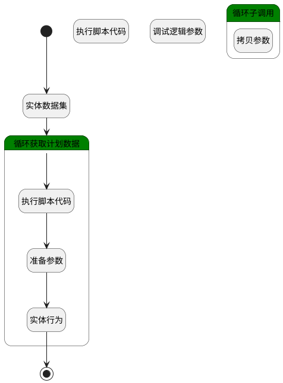

## 将计划数据更新到统计表 <!-- {docsify-ignore-all} -->

   

### 处理过程




### 处理步骤说明

#### 循环子调用 :id=LOOPSUBCALL1<sup class="footnote-symbol"> <font color=gray size=1>[循环子调用]</font></sup>


循环参数`Payee_statistic_info(统计集合)`，子循环参数使用`sub(循环临时统计数据)`
#### 开始 :id=Begin<sup class="footnote-symbol"> <font color=gray size=1>[开始]</font></sup>


*- N/A*
#### 执行脚本代码 :id=RAWSFCODE1<sup class="footnote-symbol"> <font color=gray size=1>[直接后台代码]</font></sup>


<p class="panel-title"><b>执行代码[JavaScript]</b></p>

```javascript
var plan_info = logic.getParam("Payee_plan_info")
var statistic_info = logic.getParam("Payee_statistic_info")

// 获取当前年份和月份
var currentYear = new Date().getFullYear();
var currentMonth = new Date().getMonth() + 1; // 月份从 0 开始，所以要加 1


for(var i=0;i<plan_info.size;i++){
    var statistic; 
    var plan = plan_info.get(i);
    // 后台传入的 Date 格式时间
    if(plan.get("planned_time").length == 0){
        statistic.set("NAME","未明确");
        statistic.set("TYPE", 0)
    }else{
    var backendDate = new Date(plan.get("planned_time"));
    // 转换为本地时间
    var localDate = new Date(backendDate.getTime() + backendDate.getTimezoneOffset() * 60000);
    // 获取传入时间的年份和月份
    var backendYear = localDate.getFullYear();
    var backendMonth = localDate.getMonth() + 1; // 月份从 0 开始，所以要加 1
   if (backendYear > currentYear) {
        statistic.set("name", backendYear+"-"+backendMonth);
        statistic.set("type", 3)
    }  else {
        statistic.set("name", backendYear+"-"+backendMonth);
        statistic.set("type", 2)
    }
    }
    statistic.set("amount",plan.get("amount"));
    statistic = plan;
    statistic_info.push(statistic);
}
```

#### 拷贝参数 :id=COPYPARAM1<sup class="footnote-symbol"> <font color=gray size=1>[拷贝参数]</font></sup>


拷贝参数`sub(循环临时统计数据)` 到 `Payee_stistic(统计信息)`

#### 调试逻辑参数 :id=DEBUGPARAM1<sup class="footnote-symbol"> <font color=gray size=1>[调试逻辑参数]</font></sup>


> [!NOTE|label:调试信息|icon:fa fa-bug]
> 调试输出参数`Payee_statistic_info(统计集合)`的详细信息


#### 结束 :id=END1<sup class="footnote-symbol"> <font color=gray size=1>[结束]</font></sup>


*- N/A*

#### 实体行为 :id=DEACTION1<sup class="footnote-symbol"> <font color=gray size=1>[实体行为]</font></sup>


调用实体 [收款情况统计(PAYEE_STATISTIC)](module/crm/payee_statistic.md) 行为 [Create](module/crm/payee_statistic#行为) ，行为参数为`Payee_stistic(统计信息)`

#### 准备参数 :id=PREPAREPARAM1<sup class="footnote-symbol"> <font color=gray size=1>[准备参数]</font></sup>


1. 将`statistic(统计信息子数据).NAME(名称)` 设置给  `Payee_stistic(统计信息).NAME(名称)`
2. 将`statistic(统计信息子数据).STATISTIC_DATE(统计时间)` 设置给  `Payee_stistic(统计信息).STATISTIC_DATE(统计时间)`
3. 将`空值（NULL）` 设置给  `Payee_stistic(统计信息).ID(标识)`
4. 将`statistic(统计信息子数据).AMOUNT(收款金额)` 设置给  `Payee_stistic(统计信息).AMOUNT(收款金额)`
5. 将`statistic(统计信息子数据).TYPE(类型)` 设置给  `Payee_stistic(统计信息).TYPE(类型)`

#### 实体数据集 :id=DEDATASET1<sup class="footnote-symbol"> <font color=gray size=1>[实体数据集]</font></sup>


调用实体 [收款计划(PAYEE_PLAN)](module/crm/payee_plan.md) 数据集合 [全部(all)](module/crm/payee_plan#数据集合) ，查询参数为`payee_plan2(汇款计划（空）)`

将执行结果返回给参数`Payee_plan_info(计划集合)`

#### 循环获取计划数据 :id=LOOPSUBCALL2<sup class="footnote-symbol"> <font color=gray size=1>[循环子调用]</font></sup>


循环参数`Payee_plan_info(计划集合)`，子循环参数使用`sub(循环临时统计数据)`
#### 执行脚本代码 :id=RAWSFCODE2<sup class="footnote-symbol"> <font color=gray size=1>[直接后台代码]</font></sup>


<p class="panel-title"><b>执行代码[JavaScript]</b></p>

```javascript
var plan = logic.getParam("sub")
var statistic = logic.getParam("statistic")

// 获取当前年份和月份
var currentYear = new Date().getFullYear();
var currentMonth = new Date().getMonth() + 1; // 月份从 0 开始，所以要加 1

    // 后台传入的 Date 格式时间
    if(null == plan.get("planned_time")){
        statistic.set("NAME","");
        statistic.set("TYPE", 0)
    }else{
     var backendDate = new Date(plan.get("planned_time"));
    // 获取传入时间的年份和月份
    var backendYear = backendDate.getFullYear();
    var backendMonth = backendDate.getMonth() + 1; // 使用 backendDate 中的月份

    // 格式化月份为两位数，如 01, 02, ..., 12
    var formattedMonth = backendMonth <= 9 ? "0" + backendMonth : backendMonth.toString();

    statistic.set("name", backendYear + "-" + formattedMonth);
    statistic.set("type", 2);

    // 设置统计日期为每月的 1 号
    statistic.set("statistic_date", new Date(backendYear, backendMonth - 1, 1));
    }
    statistic.set("amount", plan.get("amount"));
```


### 实体逻辑参数

|    中文名   |    代码名    |  数据类型    |  实体   |备注 |
| --------| --------| -------- | -------- | --------   |
|传入变量(<i class="fa fa-check"/></i>)|Default|数据对象|[收款情况统计(PAYEE_STATISTIC)](module/crm/payee_statistic.md)||
|汇款计划|Payee_plan|数据对象|[收款计划(PAYEE_PLAN)](module/crm/payee_plan.md)||
|计划集合|Payee_plan_info|分页查询|||
|统计集合|Payee_statistic_info|数据对象列表|[收款情况统计(PAYEE_STATISTIC)](module/crm/payee_statistic.md)||
|统计信息|Payee_stistic|数据对象|[收款情况统计(PAYEE_STATISTIC)](module/crm/payee_statistic.md)||
|汇款计划（空）|payee_plan2|过滤器|||
|统计信息子数据|statistic|数据对象|[收款情况统计(PAYEE_STATISTIC)](module/crm/payee_statistic.md)||
|循环临时统计数据|sub|数据对象|[收款计划(PAYEE_PLAN)](module/crm/payee_plan.md)||
