## 导航到表格视图(只传搜索表单参数) <!-- {docsify-ignore-all} -->

   

### 处理过程

```plantuml
@startuml
hide footbox
<style>
root {
  HyperlinkColor #42b983
}
</style>

hide empty description
state "开始" as Begin <<start>> [[$./exp_to_gridview3#begin {开始}]]
state "准备视图参数" as PREPAREJSPARAM1  [[$./exp_to_gridview3#preparejsparam1 {准备视图参数}]]
state "调试逻辑参数" as DEBUGPARAM1  [[$./exp_to_gridview3#debugparam1 {调试逻辑参数}]]
state "结束" as END1 <<end>> [[$./exp_to_gridview3#end1 {结束}]]
state "视图部件事件触发" as VIEWCTRLFIREEVENT1  [[$./exp_to_gridview3#viewctrlfireevent1 {视图部件事件触发}]]


Begin --> DEBUGPARAM1
DEBUGPARAM1 --> PREPAREJSPARAM1
PREPAREJSPARAM1 --> VIEWCTRLFIREEVENT1
VIEWCTRLFIREEVENT1 --> END1


@enduml
```

### 处理步骤说明

#### 开始 :id=Begin [开始]

#### 结束 :id=END1 [结束]

#### 调试逻辑参数 :id=DEBUGPARAM1 [调试逻辑参数]

> [!NOTE|label:调试信息|icon:fa fa-bug]
> 调试输出参数`当前部件对象`的详细信息

#### 准备视图参数 :id=PREPAREJSPARAM1 [准备参数]

1. 将`crmweb.payee_statistic_chart_grid_view` 设置给  `viewmsg(视图信息).viewId`
2. 将`view(视图).id` 设置给  `viewmsg(视图信息).key`
3. 将`chartexpbar_chart(图表).context` 设置给  `viewmsg(视图信息).context`
4. 将`searchform(搜索表单).state.data` 设置给  `viewmsg(视图信息).params`
5. 将`false` 设置给  `viewmsg(视图信息).isCache`
6. 将`viewmsg(视图信息)` 设置给  `viewmsg(视图信息).navViewMsg`

#### 视图部件事件触发 :id=VIEWCTRLFIREEVENT1 [VIEWCTRLFIREEVENT]

触发`chartexpbar(图表导航栏)`的事件`onNavViewChange`，参数为`viewmsg(视图信息)`

### 实体逻辑参数

|    中文名   |    代码名    |  数据类型      |备注 |
| --------| --------| --------  | --------   |
|当前部件对象|ctrl|当前部件对象||
|视图信息|viewmsg|数据对象||
|图表|chartexpbar_chart|部件对象||
|搜索表单|searchform|部件对象||
|视图|view|当前视图对象||
|图表导航栏|chartexpbar|部件对象||
|传入变量(<i class="fa fa-check"/></i>)|Default|数据对象||
