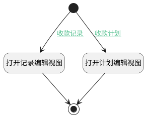

## 界面跳转至记录/计划 <!-- {docsify-ignore-all} -->

   

### 处理过程




### 处理步骤说明

#### 开始 :id=Begin<sup class="footnote-symbol"> <font color=gray size=1>[开始]</font></sup>


#### 打开记录编辑视图 :id=DEUIACTION2<sup class="footnote-symbol"> <font color=gray size=1>[实体界面行为调用]</font></sup>


调用实体 [收款记录(PAYEE)](module/crm/payee.md) 界面行为 [打开记录编辑视图](module/crm/payee#界面行为) ，行为参数为`Default(传入变量)`

#### 打开计划编辑视图 :id=DEUIACTION1<sup class="footnote-symbol"> <font color=gray size=1>[实体界面行为调用]</font></sup>


调用实体 [收款计划(PAYEE_PLAN)](module/crm/payee_plan.md) 界面行为 [打开计划编辑视图](module/crm/payee_plan#界面行为) ，行为参数为`Default(传入变量)`

#### 结束 :id=END1<sup class="footnote-symbol"> <font color=gray size=1>[结束]</font></sup>


### 连接条件说明
#### 收款计划 :id=Begin-DEUIACTION1

(```Default(传入变量).type``` EQ ```0``` OR ```Default(传入变量).type``` EQ ```2``` OR ```Default(传入变量).type``` EQ ```3```)
#### 收款记录 :id=Begin-DEUIACTION2

```Default(传入变量).type``` EQ ```1```


### 实体逻辑参数

|    中文名   |    代码名    |  数据类型      |备注 |
| --------| --------| --------  | --------   |
|传入变量(<i class="fa fa-check"/></i>)|Default|数据对象||
