## 取消关联 <!-- {docsify-ignore-all} -->

   

### 处理过程

```plantuml
@startuml
hide empty description
<style>
root {
  HyperlinkColor #42b983
}
</style>

hide empty description
state "开始" as Begin <<start>> [[$./unlink#begin {"开始"}]]
state "设置查询条件" as PREPAREPARAM2  [[$./unlink#prepareparam2 {"设置查询条件"}]]
state "查询管理数据" as DEDATAQUERY1  [[$./unlink#dedataquery1 {"查询管理数据"}]]
state "获取关联数据" as BINDPARAM1  [[$./unlink#bindparam1 {"获取关联数据"}]]
state "删除关联数据" as DEACTION1  [[$./unlink#deaction1 {"删除关联数据"}]]
state "结束" as END1 <<end>> [[$./unlink#end1 {"结束"}]]


Begin --> PREPAREPARAM2
PREPAREPARAM2 --> DEDATAQUERY1
DEDATAQUERY1 --> BINDPARAM1
BINDPARAM1 --> DEACTION1
DEACTION1 --> END1


@enduml
```

### 处理步骤说明

#### 开始 :id=Begin [开始]

*- N/A*
#### 设置查询条件 :id=PREPAREPARAM2 [准备参数]

1. 将`Default(传入变量).ID(标识)` 设置给  `relationFilter(关联数据查询条件).N_TARGET_ID_EQ`
2. 将`Default(传入变量).PRINCIPAL_ID` 设置给  `relationFilter(关联数据查询条件).N_PRINCIPAL_ID_EQ`

#### 查询管理数据 :id=DEDATAQUERY1 [实体数据查询]

调用实体 [关联(RELATION)](module/crm/relation.md) 数据查询 [数据查询(DEFAULT)](module/crm/relation#数据查询) ，查询参数为`relationFilter(关联数据查询条件)`

将执行结果返回给参数`relationList(关联数据集合)`

#### 获取关联数据 :id=BINDPARAM1 [绑定参数]

绑定参数`relationList(关联数据集合)` 到 `relation(关联数据)`
#### 删除关联数据 :id=DEACTION1 [实体行为]

调用实体 [关联(RELATION)](module/crm/relation.md) 行为 [Remove](module/crm/relation#行为) ，行为参数为`relation(关联数据)`

#### 结束 :id=END1 [结束]

*- N/A*

### 实体逻辑参数

|    中文名   |    代码名    |  数据类型    |  实体   |备注 |
| --------| --------| -------- | -------- | --------   |
|传入变量(<i class="fa fa-check"/></i>)|Default|数据对象|[产品(PRODUCT)](module/crm/product.md)||
|关联数据|relation|数据对象|[关联(RELATION)](module/crm/relation.md)||
|关联数据查询条件|relationFilter|过滤器|||
|关联数据集合|relationList|数据对象列表|[关联(RELATION)](module/crm/relation.md)||
