## 通过父订单查询客户 <!-- {docsify-ignore-all} -->

   

### 处理过程

```plantuml
@startuml
hide empty description
<style>
root {
  HyperlinkColor #42b983
}
</style>

hide empty description
state "开始" as Begin <<start>> [[$./GetAccount#begin {"开始"}]]
state "准备参数" as PREPAREPARAM1  [[$./GetAccount#prepareparam1 {"准备参数"}]]
state "实体行为" as DEACTION1  [[$./GetAccount#deaction1 {"实体行为"}]]
state "结束" as END1 <<end>> [[$./GetAccount#end1 {"结束"}]]


Begin --> PREPAREPARAM1 : [[$./GetAccount#begin-prepareparam1{连接名称} 连接名称]]
PREPAREPARAM1 --> DEACTION1
DEACTION1 --> END1


@enduml
```

### 处理步骤说明

#### 准备参数 :id=PREPAREPARAM1 [准备参数]

1. 将`Default(传入变量).PID(父标识)` 设置给  `PARENT_PROJECT(父订单).ID(标识)`

#### 实体行为 :id=DEACTION1 [实体行为]

调用实体 [订单(PROJECT)](module/crm/project.md) 行为 [Get](module/crm/project#行为) ，行为参数为`PARENT_PROJECT(父订单)`

将执行结果返回给参数`Default(传入变量)`

#### 结束 :id=END1 [结束]

返回 `PARENT_PROJECT(父订单)`

#### 开始 :id=Begin [开始]

*- N/A*

### 连接条件说明
#### 连接名称 :id=Begin-PREPAREPARAM1

`Default(传入变量).PID(父标识)` ISNOTNULL

### 实体逻辑参数

|    中文名   |    代码名    |  数据类型    |  实体   |备注 |
| --------| --------| -------- | -------- | --------   |
|传入变量(<i class="fa fa-check"/></i>)|Default|数据对象|[订单(PROJECT)](module/crm/project.md)||
|父订单|PARENT_PROJECT|数据对象|[订单(PROJECT)](module/crm/project.md)||
