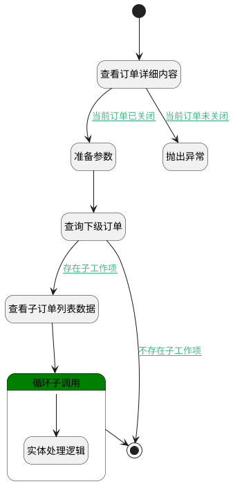

## 循环子订单判断 <!-- {docsify-ignore-all} -->

   循环订单下的子订单来判断是否有未关闭的订单

### 处理过程

### 处理步骤说明

#### 开始 :id=Begin [开始]

*- N/A*
#### 抛出异常 :id=THROWEXCEPTION1 [抛出异常]

> [!ATTENTION|label:抛出异常|icon:fa fa-warning]
> 错误信息：有子订单未关闭，请检查！

#### 查看订单详细内容 :id=DEBUGPARAM3 [调试逻辑参数]

> [!NOTE|label:调试信息|icon:fa fa-bug]
> 调试输出参数`Default(传入变量)`的详细信息

#### 准备参数 :id=PREPAREPARAM1 [准备参数]

1. 将`Default(传入变量).ID(标识)` 设置给  `project_pid_filter(订单过滤pid).n_pid_eq`

#### 查询下级订单 :id=DEDATASET1 [实体数据集]

调用实体 [订单(PROJECT)](module/crm/project.md) 数据集合 [数据集(DEFAULT)](module/crm/project#数据集合) ，查询参数为`project_pid_filter(订单过滤pid)`

将执行结果返回给参数`project_info(订单列表)`

#### 查看子订单列表数据 :id=DEBUGPARAM2 [调试逻辑参数]

> [!NOTE|label:调试信息|icon:fa fa-bug]
> 调试输出参数`project_info(订单列表)`的详细信息

#### 循环子调用 :id=LOOPSUBCALL1 [循环子调用]

循环参数`project_info(订单列表)`，子循环参数使用`project_sub(循环临时统计数据)`
#### 实体处理逻辑 :id=DELOGIC1 [实体逻辑]

调用实体 [订单(PROJECT)](module/crm/project.md) 处理逻辑 [循环子订单判断]((module/crm/project/logic/loop_son_project.md)) ，行为参数为`project_sub(循环临时统计数据)`

#### 结束 :id=END1 [结束]

*- N/A*

### 连接条件说明
#### 当前订单已关闭 :id=DEBUGPARAM3-PREPAREPARAM1

`Default(传入变量).STATUS(状态)` EQ `20`
#### 存在子工作项 :id=DEDATASET1-DEBUGPARAM2

`project_info(订单列表).size` GT `0`
#### 不存在子工作项 :id=DEDATASET1-END1

`project_info(订单列表).size` EQ `0`
#### 当前订单未关闭 :id=DEBUGPARAM3-THROWEXCEPTION1

`Default(传入变量).STATUS(状态)` NOTEQ `20`

### 实体逻辑参数

|    中文名   |    代码名    |  数据类型    |  实体   |备注 |
| --------| --------| -------- | -------- | --------   |
|传入变量(<i class="fa fa-check"/></i>)|Default|数据对象|[订单(PROJECT)](module/crm/project.md)||
|订单列表|project_info|分页查询|||
|订单过滤pid|project_pid_filter|过滤器|||
|循环临时统计数据|project_sub|数据对象|[订单(PROJECT)](module/crm/project.md)||
