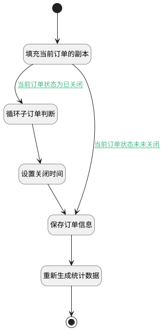

## 检测子订单状态后保存订单 <!-- {docsify-ignore-all} -->

   判断子订单状态，如果出现未关闭订单则提示订单状态；调用了【循环子订判断】的逻辑

### 处理过程




### 处理步骤说明

#### 开始 :id=Begin<sup class="footnote-symbol"> <font color=gray size=1>[开始]</font></sup>


*- N/A*
#### 填充当前订单的副本 :id=PREPAREPARAM1<sup class="footnote-symbol"> <font color=gray size=1>[准备参数]</font></sup>

给当前订单副本的状态赋值为已关闭

1. 将`Default(传入变量).ID(标识)` 设置给  `project_copy(子订单数据副本).ID(标识)`
2. 将`20` 设置给  `project_copy(子订单数据副本).STATUS(状态)`

#### 循环子订单判断 :id=DELOGIC1<sup class="footnote-symbol"> <font color=gray size=1>[实体逻辑]</font></sup>


调用实体 [订单(PROJECT)](module/crm/project.md) 处理逻辑 [循环子订单判断]((module/crm/project/logic/loop_son_project.md)) ，行为参数为`project_copy(子订单数据副本)`

#### 设置关闭时间 :id=RAWSFCODE1<sup class="footnote-symbol"> <font color=gray size=1>[直接后台代码]</font></sup>


<p class="panel-title"><b>执行代码[JavaScript]</b></p>

```javascript
var defaultObj = logic.getParam("default");
defaultObj.set("closed_date", new Date());
```

#### 保存订单信息 :id=DEACTION1<sup class="footnote-symbol"> <font color=gray size=1>[实体行为]</font></sup>


调用实体 [订单(PROJECT)](module/crm/project.md) 行为 [Save](module/crm/project#行为) ，行为参数为`Default(传入变量)`

#### 重新生成统计数据 :id=DEACTION2<sup class="footnote-symbol"> <font color=gray size=1>[实体行为]</font></sup>


调用实体 [收款情况统计(PAYEE_STATISTIC)](module/crm/payee_statistic.md) 行为 [异步计算统计数据(Async_Calculation)](module/crm/payee_statistic#行为) ，行为参数为`Default(传入变量)`

#### 结束 :id=END1<sup class="footnote-symbol"> <font color=gray size=1>[结束]</font></sup>


返回 `Default(传入变量)`


### 连接条件说明
#### 当前订单状态为已关闭 :id=PREPAREPARAM1-DELOGIC1

`Default(传入变量).STATUS(状态)` EQ `20`
#### 当前订单状态未未关闭 :id=PREPAREPARAM1-DEACTION1

`Default(传入变量).STATUS(状态)` NOTEQ `20`


### 实体逻辑参数

|    中文名   |    代码名    |  数据类型    |  实体   |备注 |
| --------| --------| -------- | -------- | --------   |
|传入变量(<i class="fa fa-check"/></i>)|Default|数据对象|[订单(PROJECT)](module/crm/project.md)||
|子订单数据副本|project_copy|数据对象|[订单(PROJECT)](module/crm/project.md)|用于判断子订单数据，不影响当前保存数据的副本|
