## 税率(TAX) <!-- {docsify-ignore-all} -->

   

### 税率值规则 :id=DEFValueRule

```plantuml
@startuml
hide empty description
<style>
root {
  HyperlinkColor #42b983
}
</style>

state "start" as start  <<start>>
state "end" as end <<end>>
state "(TAX) TAX" as e019302d6d8630e0a198be1faa716cb0 [[$./Tax#ae019302d6d8630e0a198be1faa716cb0 {"[数值范围] TAX"}]]


start --> e019302d6d8630e0a198be1faa716cb0 
e019302d6d8630e0a198be1faa716cb0 --> end 


@enduml
```

#### 条件说明

##### (TAX) TAX :id=af47715aafd0a42b9770fd92ff85c04b9

`TAX(税率)` 值在区间 `
(-∞ , 100.0]` 内

> [!ATTENTION|label:规则信息|icon:fa fa-warning]
> 税率必须在[0~100]之间

### 比率值规则 :id=DEFValueRule2

```plantuml
@startuml
hide empty description
<style>
root {
  HyperlinkColor #42b983
}
</style>

state "start" as start  <<start>>
state "end" as end <<end>>
state "(ratio) ratio" as 485990db4e1a4521bf1b746b5fddae04 [[$./Tax#a485990db4e1a4521bf1b746b5fddae04 {"[数值范围] ratio"}]]


start --> 485990db4e1a4521bf1b746b5fddae04 
485990db4e1a4521bf1b746b5fddae04 --> end 


@enduml
```

#### 条件说明

##### (ratio) ratio :id=a485990db4e1a4521bf1b746b5fddae04

`ratio` 值在区间 `
(-∞ , 100.0]` 内

> [!ATTENTION|label:规则信息|icon:fa fa-warning]
> 比率需要在[1~100]之间

