## 取消关联(线索) <!-- {docsify-ignore-all} -->

   

### 处理过程

```plantuml
@startuml
hide empty description
<style>
root {
  HyperlinkColor #42b983
}
</style>

hide empty description
state "开始" as Begin <<start>> [[$./lead_cancel_relation#begin {"开始"}]]
state "拼接关系主键" as RAWSFCODE1  [[$./lead_cancel_relation#rawsfcode1 {"拼接关系主键"}]]
state "删除关联" as DEACTION1  [[$./lead_cancel_relation#deaction1 {"删除关联"}]]
state "结束" as END1 <<end>> [[$./lead_cancel_relation#end1 {"结束"}]]


Begin --> RAWSFCODE1
RAWSFCODE1 --> DEACTION1
DEACTION1 --> END1


@enduml
```




### 处理步骤说明

#### 开始 :id=Begin<sup class="footnote-symbol"> <font color=gray size=1>[开始]</font></sup>


*- N/A*
#### 拼接关系主键 :id=RAWSFCODE1<sup class="footnote-symbol"> <font color=gray size=1>[直接后台代码]</font></sup>


<p class="panel-title"><b>执行代码[JavaScript]</b></p>

```javascript
// var relation_obj = logic.getParam("relation_obj");
// var _default = logic.getParam("Default");
// if(_default.get("principal_id") != null && _default.get("id") != null  &&  _default.get("type") != null){
//     relation_obj.set("id", _default.get("principal_id") + "_" + _default.get("id") + '_' + _default.get("type"));
// }
var relation_obj = logic.getParam("relation_obj");
var _default = logic.getParam("Default");

if(_default.get("principal_id") != null && _default.get("id") != null){
    relation_obj.set("id", _default.get("principal_id") + "_" + _default.get("id") + '_' + 'LEAD');
}


```

#### 删除关联 :id=DEACTION1<sup class="footnote-symbol"> <font color=gray size=1>[实体行为]</font></sup>


调用实体 [关联(RELATION)](module/crm/relation.md) 行为 [Remove](module/crm/relation#行为) ，行为参数为`relation_obj(关联)`

#### 结束 :id=END1<sup class="footnote-symbol"> <font color=gray size=1>[结束]</font></sup>


返回 `Default(传入变量)`


### 实体逻辑参数

|    中文名   |    代码名    |  数据类型    |  实体   |备注 |
| --------| --------| -------- | -------- | --------   |
|传入变量(<i class="fa fa-check"/></i>)|Default|数据对象|[任务&活动(TASK)](module/crm/task.md)||
|关联|relation_obj|数据对象|[关联(RELATION)](module/crm/relation.md)||
