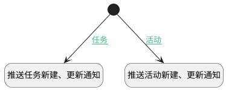

## 新建、更新任务后推送 <!-- {docsify-ignore-all} -->

   

### 处理过程

### 处理步骤说明

#### 开始 :id=Begin [开始]

*- N/A*
#### 推送任务新建、更新通知 :id=DENOTIFY1 [实体通知]

调用实体 [任务&活动(TASK)](module/crm/task.md) 通知 [任务新建、更新通知(taskChangeNotify)](module/crm/task/notify/taskChangeNotify) ，参数为`Default(传入变量)`
#### 推送活动新建、更新通知 :id=DENOTIFY2 [实体通知]

调用实体 [任务&活动(TASK)](module/crm/task.md) 通知 [活动新建、更新通知(maneuverChangeNotify)](module/crm/task/notify/maneuverChangeNotify) ，参数为`Default(传入变量)`

### 连接条件说明
#### 任务 :id=Begin-DENOTIFY1

`Default(传入变量).TYPE(类型)` EQ `TASK`
#### 活动 :id=Begin-DENOTIFY2

`Default(传入变量).TYPE(类型)` EQ `MANEUVER`

### 实体逻辑参数

|    中文名   |    代码名    |  数据类型    |  实体   |备注 |
| --------| --------| -------- | -------- | --------   |
|传入变量(<i class="fa fa-check"/></i>)|Default|数据对象|[任务&活动(TASK)](module/crm/task.md)||
