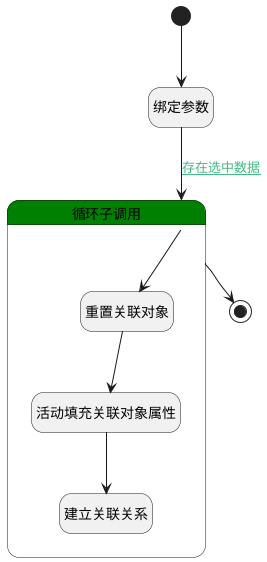

## 关联任务和活动 <!-- {docsify-ignore-all} -->

   

### 处理过程




### 处理步骤说明

#### 开始 :id=Begin<sup class="footnote-symbol"> <font color=gray size=1>[开始]</font></sup>


*- N/A*
#### 绑定参数 :id=BINDPARAM1<sup class="footnote-symbol"> <font color=gray size=1>[绑定参数]</font></sup>


绑定参数`Default(传入变量)` 到 `selectDate(关联列表)`
#### 循环子调用 :id=LOOPSUBCALL1<sup class="footnote-symbol"> <font color=gray size=1>[循环子调用]</font></sup>


循环参数`selectDate(关联列表)`，子循环参数使用`for_temp_obj(循环临时变量)`
#### 重置关联对象 :id=RESETPARAM1<sup class="footnote-symbol"> <font color=gray size=1>[重置参数]</font></sup>


重置参数```relation_obj(关系对象)```
#### 活动填充关联对象属性 :id=PREPAREPARAM1<sup class="footnote-symbol"> <font color=gray size=1>[准备参数]</font></sup>


1. 将`for_temp_obj(循环临时变量).ID(标识)` 设置给  `relation_obj(关系对象).TARGET_ID(关联目标标识)`
2. 将`TASK` 设置给  `relation_obj(关系对象).PRINCIPAL_TYPE(关联主体类型)`
3. 将`Default(传入变量).ID(标识)` 设置给  `relation_obj(关系对象).PRINCIPAL_ID(关联主体标识)`

#### 建立关联关系 :id=DEACTION1<sup class="footnote-symbol"> <font color=gray size=1>[实体行为]</font></sup>


调用实体 [关联(RELATION)](module/crm/relation.md) 行为 [Save](module/crm/relation#行为) ，行为参数为`relation_obj(关系对象)`

#### 结束 :id=END1<sup class="footnote-symbol"> <font color=gray size=1>[结束]</font></sup>


*- N/A*


### 连接条件说明
#### 存在选中数据 :id=BINDPARAM1-LOOPSUBCALL1

`selectDate(关联列表).size` GT `0`


### 实体逻辑参数

|    中文名   |    代码名    |  数据类型    |  实体   |备注 |
| --------| --------| -------- | -------- | --------   |
|传入变量(<i class="fa fa-check"/></i>)|Default|数据对象|[任务&活动(TASK)](module/crm/task.md)||
|循环临时变量|for_temp_obj|数据对象|[任务&活动(TASK)](module/crm/task.md)||
|关系对象|relation_obj|数据对象|[关联(RELATION)](module/crm/relation.md)||
|关联列表|selectDate|数据对象列表|[任务&活动(TASK)](module/crm/task.md)||
