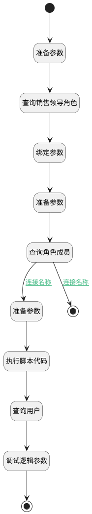

## 查询销售领导 <!-- {docsify-ignore-all} -->

   

### 处理过程




### 处理步骤说明

#### 结束 :id=END2<sup class="footnote-symbol"> <font color=gray size=1>[结束]</font></sup>


*- N/A*

#### 准备参数 :id=PREPAREPARAM3<sup class="footnote-symbol"> <font color=gray size=1>[准备参数]</font></sup>


1. 将`用户全局对象.srfpersonid` 设置给  `user_filter(用户过滤器).N_SYSUSERID_NOTEQ`

#### 结束 :id=END1<sup class="footnote-symbol"> <font color=gray size=1>[结束]</font></sup>


返回 `user_page(用户结果)`

#### 准备参数 :id=PREPAREPARAM1<sup class="footnote-symbol"> <font color=gray size=1>[准备参数]</font></sup>


1. 将`role(权限信息).id(标识)` 设置给  `member_filter(角色成员过滤器).n_role_id_eq`

#### 查询角色成员 :id=DEDATASET1<sup class="footnote-symbol"> <font color=gray size=1>[实体数据集]</font></sup>


调用实体 [系统角色成员(SYS_ROLE_MEMBER)](module/runtime/sys_role_member.md) 数据集合 [数据集(DEFAULT)](module/runtime/sys_role_member#数据集合) ，查询参数为`member_filter(角色成员过滤器)`

将执行结果返回给参数`member_page(销售领导分页结果)`

#### 执行脚本代码 :id=RAWSFCODE1<sup class="footnote-symbol"> <font color=gray size=1>[直接后台代码]</font></sup>


<p class="panel-title"><b>执行代码[JavaScript]</b></p>

```javascript
var member_page = logic.getParam("member_page");
var user_filter = logic.getParam("user_filter");
var user_ids = "";
for (var i = 0; i < member_page.length; i++) {
if(i>0){
user_ids = user_ids+",";
}
var id = member_page.get(i);
user_ids = user_ids + id.get("member_uid");
}
if(user_ids != ""){
user_filter.in("sysuserId",user_ids);
}
```

#### 查询用户 :id=DEDATASET2<sup class="footnote-symbol"> <font color=gray size=1>[实体数据集]</font></sup>


调用实体 [用户(USER)](module/crm/user.md) 数据集合 [数据集(DEFAULT)](module/crm/user#数据集合) ，查询参数为`user_filter(用户过滤器)`

将执行结果返回给参数`user_page(用户结果)`

#### 调试逻辑参数 :id=DEBUGPARAM1<sup class="footnote-symbol"> <font color=gray size=1>[调试逻辑参数]</font></sup>


> [!NOTE|label:调试信息|icon:fa fa-bug]
> 调试输出参数`user_page(用户结果)`的详细信息


#### 开始 :id=Begin<sup class="footnote-symbol"> <font color=gray size=1>[开始]</font></sup>


*- N/A*
#### 准备参数 :id=PREPAREPARAM2<sup class="footnote-symbol"> <font color=gray size=1>[准备参数]</font></sup>


1. 将`SalesLeader` 设置给  `role_filter(权限过滤).n_authority_eq`
2. 将`用户全局对象.srfsystemid` 设置给  `role_filter(权限过滤). n_deploy_system_id_eq`

#### 查询销售领导角色 :id=DEDATASET3<sup class="footnote-symbol"> <font color=gray size=1>[实体数据集]</font></sup>


调用实体 [系统角色(SYS_ROLE_UAA)](module/runtime/sys_role.md) 数据集合 [数据集(DEFAULT)](module/runtime/sys_role#数据集合) ，查询参数为`role_filter(权限过滤)`

将执行结果返回给参数`role_page(权限结果)`

#### 绑定参数 :id=BINDPARAM1<sup class="footnote-symbol"> <font color=gray size=1>[绑定参数]</font></sup>


绑定参数`role_page(权限结果)` 到 `role(权限信息)`

### 连接条件说明
#### 连接名称 :id=DEDATASET1-PREPAREPARAM3

`member_page(销售领导分页结果).size` GT `0`
#### 连接名称 :id=DEDATASET1-END2

`member_page(销售领导分页结果).size` EQ `0`


### 实体逻辑参数

|    中文名   |    代码名    |  数据类型    |  实体   |备注 |
| --------| --------| -------- | -------- | --------   |
|传入变量(<i class="fa fa-check"/></i>)|Default|过滤器|||
|角色成员过滤器|member_filter|过滤器|||
|销售领导分页结果|member_page|分页查询|||
|权限信息|role|数据对象|[系统角色(SYS_ROLE_UAA)](module/runtime/sys_role.md)||
|权限过滤|role_filter|过滤器|||
|权限结果|role_page|分页查询|||
|用户过滤器|user_filter|过滤器|||
|用户结果|user_page|分页查询|||
