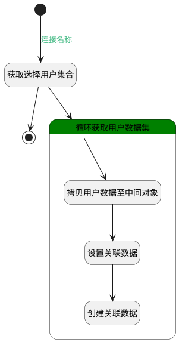

## 添加客户关联销售 <!-- {docsify-ignore-all} -->

   

### 处理过程

### 处理步骤说明

#### 开始 :id=Begin [开始]

*- N/A*
#### 获取选择用户集合 :id=PREPAREPARAM1 [准备参数]

1. 将`Default(传入变量).srfactionparam` 绑定给  `srfactionparam`

#### 循环获取用户数据集 :id=LOOPSUBCALL1 [循环子调用]

循环参数`srfactionparam`，子循环参数使用`sub`
#### 拷贝用户数据至中间对象 :id=COPYPARAM1 [拷贝参数]

拷贝参数`sub` 到 `item`

#### 结束 :id=END1 [结束]

*- N/A*

#### 设置关联数据 :id=PREPAREPARAM2 [准备参数]

1. 将`Default(传入变量).principal_id` 设置给  `relation(关联数据).PRINCIPAL_ID(关联主体标识)`
2. 将`Default(传入变量).principal_type` 设置给  `relation(关联数据).PRINCIPAL_TYPE(关联主体类型)`
3. 将`item.ID(标识)` 设置给  `relation(关联数据).TARGET_ID(关联目标标识)`
4. 将`USER` 设置给  `relation(关联数据).TARGET_TYPE(关联目标类型)`
5. 将`空值（NULL）` 设置给  `relation(关联数据).ID(标识)`

#### 创建关联数据 :id=DEACTION1 [实体行为]

调用实体 [关联(RELATION)](module/crm/relation.md) 行为 [Save](module/crm/relation#行为) ，行为参数为`relation(关联数据)`

### 连接条件说明
#### 连接名称 :id=Begin-PREPAREPARAM1

`Default(传入变量).srfactionparam` ISNOTNULL

### 实体逻辑参数

|    中文名   |    代码名    |  数据类型    |  实体   |备注 |
| --------| --------| -------- | -------- | --------   |
|传入变量(<i class="fa fa-check"/></i>)|Default|数据对象|[用户(USER)](module/crm/user.md)||
|item|item|数据对象|[用户(USER)](module/crm/user.md)||
|关联数据|relation|数据对象|[关联(RELATION)](module/crm/relation.md)||
|srfactionparam|srfactionparam|数据对象列表|||
|sub|sub|数据对象|||
