## 创建账号 <!-- {docsify-ignore-all} -->

   

### 处理过程

```plantuml
@startuml
hide empty description
<style>
root {
  HyperlinkColor #42b983
}
</style>

hide empty description
state "开始" as Begin <<start>> [[$./createSysPerson#begin {"开始"}]]
state "结束" as END1 <<end>> [[$./createSysPerson#end1 {"结束"}]]
state "创建用户" as DEACTION1  [[$./createSysPerson#deaction1 {"创建用户"}]]
state "设置RT用户信息" as PREPAREPARAM1  [[$./createSysPerson#prepareparam1 {"设置RT用户信息"}]]
state "绑定管理员角色" as DEACTION4  [[$./createSysPerson#deaction4 {"绑定管理员角色"}]]
state "创建RT用户" as DEACTION2  [[$./createSysPerson#deaction2 {"创建RT用户"}]]
state "设置管理员角色" as PREPAREPARAM4  [[$./createSysPerson#prepareparam4 {"设置管理员角色"}]]
state "获取RT标识" as PREPAREPARAM2  [[$./createSysPerson#prepareparam2 {"获取RT标识"}]]
state "获取查询角色" as BINDPARAM1  [[$./createSysPerson#bindparam1 {"获取查询角色"}]]
state "更新用户的关联标识" as DEACTION3  [[$./createSysPerson#deaction3 {"更新用户的关联标识"}]]
state "设置角色查询条件" as PREPAREPARAM3  [[$./createSysPerson#prepareparam3 {"设置角色查询条件"}]]
state "查询角色数据" as DEDATASET1  [[$./createSysPerson#dedataset1 {"查询角色数据"}]]


Begin --> DEACTION1
DEACTION1 --> PREPAREPARAM1
PREPAREPARAM1 --> DEACTION2
DEACTION2 --> PREPAREPARAM2
PREPAREPARAM2 --> DEACTION3
DEACTION3 --> PREPAREPARAM3
PREPAREPARAM3 --> DEDATASET1
DEDATASET1 --> BINDPARAM1
BINDPARAM1 --> PREPAREPARAM4
PREPAREPARAM4 --> DEACTION4
DEACTION4 --> END1


@enduml
```

### 处理步骤说明

#### 开始 :id=Begin [开始]

*- N/A*
#### 结束 :id=END1 [结束]

*- N/A*

#### 创建用户 :id=DEACTION1 [实体行为]

调用实体 [用户(USER)](module/crm/user.md) 行为 [Create](module/crm/user#行为) ，行为参数为`Default(传入变量)`

#### 设置RT用户信息 :id=PREPAREPARAM1 [准备参数]

1. 将`Default(传入变量).USER_NAME(账号)` 设置给  `person(人员).UID(uid/loginname)`
2. 将`用户全局对象.srforgid` 设置给  `person(人员).ORGANIZATION_ID(组织机构标识)`
3. 将`Default(传入变量).FIRST_NAME(姓名)` 设置给  `person(人员).DISPLAY_NAME(名称)`
4. 将`Default(传入变量).USER_NAME(账号)` 设置给  `person(人员).EMPLOYEE_NUMBER(人员编号)`

#### 绑定管理员角色 :id=DEACTION4 [实体行为]

调用实体 [系统角色成员(SYS_ROLE_MEMBER)](module/runtime/sys_role_member.md) 行为 [Create](module/runtime/sys_role_member#行为) ，行为参数为`role_member(角色成员)`

#### 创建RT用户 :id=DEACTION2 [实体行为]

调用实体 [人员(SYS_PERSON)](module/runtime/sys_person.md) 行为 [Create](module/runtime/sys_person#行为) ，行为参数为`person(人员)`

#### 设置管理员角色 :id=PREPAREPARAM4 [准备参数]

1. 将`role(角色).ID(标识)` 设置给  `role_member(角色成员).ROLE_ID(系统角色标识)`
2. 将`person(人员).ID(标识)` 设置给  `role_member(角色成员).MEMBER_UID(用户组/人员标识)`

#### 获取RT标识 :id=PREPAREPARAM2 [准备参数]

1. 将`person(人员).ID(标识)` 设置给  `Default(传入变量).SYSUSERID(rt用户标识)`

#### 获取查询角色 :id=BINDPARAM1 [绑定参数]

绑定参数`roleList(角色查询结果)` 到 `role(角色)`
#### 更新用户的关联标识 :id=DEACTION3 [实体行为]

调用实体 [用户(USER)](module/crm/user.md) 行为 [Update](module/crm/user#行为) ，行为参数为`Default(传入变量)`

#### 设置角色查询条件 :id=PREPAREPARAM3 [准备参数]

1. 将`用户全局对象.srfsystemid` 设置给  `rolefilter(角色查询过滤器).N_DEPLOY_SYSTEM_ID_EQ`
2. 将`SalesStaff` 设置给  `rolefilter(角色查询过滤器).N_AUTHORITY_EQ`

#### 查询角色数据 :id=DEDATASET1 [实体数据集]

调用实体 [系统角色(SYS_ROLE_UAA)](module/runtime/sys_role.md) 数据集合 [数据集(DEFAULT)](module/runtime/sys_role#数据集合) ，查询参数为`rolefilter(角色查询过滤器)`

将执行结果返回给参数`roleList(角色查询结果)`

### 实体逻辑参数

|    中文名   |    代码名    |  数据类型    |  实体   |备注 |
| --------| --------| -------- | -------- | --------   |
|传入变量(<i class="fa fa-check"/></i>)|Default|数据对象|[用户(USER)](module/crm/user.md)||
|人员|person|数据对象|[人员(SYS_PERSON)](module/runtime/sys_person.md)||
|角色|role|数据对象|[系统角色(SYS_ROLE_UAA)](module/runtime/sys_role.md)||
|角色查询结果|roleList|分页查询|||
|角色成员|role_member|数据对象|[系统角色成员(SYS_ROLE_MEMBER)](module/runtime/sys_role_member.md)||
|角色查询过滤器|rolefilter|过滤器|||
