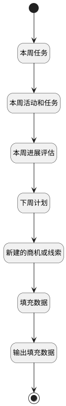

## 打开详情页获取关联数据 <!-- {docsify-ignore-all} -->

   打开详情页获取关联数据

### 处理过程




### 处理步骤说明

#### 开始 :id=Begin<sup class="footnote-symbol"> <font color=gray size=1>[开始]</font></sup>


*- N/A*
#### 本周任务 :id=RAWSQLCALL5<sup class="footnote-symbol"> <font color=gray size=1>[直接SQL调用]</font></sup>


<p class="panel-title"><b>执行sql语句</b></p>

```sql
select
	ID as TARGET_ID,
	SUBJECT  as NAME,
	'TASK' as TARGET_TYPE,
    START_TIME,
    PRIORITY,
    STATUS,
    COST,
    DESCRIPTION 
from
	TASK
where
	`TYPE` = 'TASK'
	and (CREATE_MAN = ?
		or OWNER = ?)
        and YEARWEEK(START_TIME , 1) = YEARWEEK(?, 1)
order by START_TIME desc		
```

<p class="panel-title"><b>执行sql参数</b></p>

1. `用户全局对象.srfuserid`
2. `用户全局对象.userid`
3. `Default(传入变量).START_DATE(开始时间)`

重置参数`works(本周任务)`，并将执行sql结果赋值给参数`works(本周任务)`

#### 结束 :id=END1<sup class="footnote-symbol"> <font color=gray size=1>[结束]</font></sup>


返回 `Default(传入变量)`

#### 本周活动和任务 :id=RAWSQLCALL1<sup class="footnote-symbol"> <font color=gray size=1>[直接SQL调用]</font></sup>


<p class="panel-title"><b>执行sql语句</b></p>

```sql
select
	ID as TARGET_ID,
	SUBJECT  as NAME,
	TYPE as TARGET_TYPE,
   	COALESCE(START_TIME, DUE_DATE) AS START_TIME,
    PRIORITY,
    STATUS,
    COST,
    DESCRIPTION 
from
	TASK
where
	(CREATE_MAN = ?
	or OWNER = ?)
    and 
	( 
        (YEARWEEK(START_TIME , 1) = YEARWEEK(?, 1)and TYPE = 'MANEUVER')
        or 
        (YEARWEEK(DUE_DATE, 1) = YEARWEEK(?, 1) and TYPE = 'TASK' )
	)
ORDER BY START_TIME desc;
```

<p class="panel-title"><b>执行sql参数</b></p>

1. `Default(传入变量).CREATE_MAN(建立人)`
2. `Default(传入变量).OWNER(销售人员)`
3. `Default(传入变量).START_DATE(开始时间)`
4. `Default(传入变量).START_DATE(开始时间)`

将执行sql结果赋值给参数`activities(本周活动)`

#### 输出填充数据 :id=DEBUGPARAM2<sup class="footnote-symbol"> <font color=gray size=1>[调试逻辑参数]</font></sup>


> [!NOTE|label:调试信息|icon:fa fa-bug]
> 调试输出参数`Default(传入变量)`的详细信息


#### 本周进展评估 :id=RAWSQLCALL2<sup class="footnote-symbol"> <font color=gray size=1>[直接SQL调用]</font></sup>


<p class="panel-title"><b>执行sql语句</b></p>

```sql
SELECT T1.* FROM (
select t1.id,t1.principal_type,t1.principal_name,t1.update_time,t1.principal_id,t1.content,t1.create_man from note_attach t1,task t2 where t1.PRINCIPAL_TYPE = 'TASK' and t1.principal_id = t2.id and (t1.CREATE_MAN = ? or EXISTS (SELECT 1 FROM task_executor T21 WHERE T21.TASK_ID = T1.PRINCIPAL_ID AND T21.USER_ID = ?))
UNION ALL
select t1.id,t1.principal_type,CONCAT('（',t3.account_name,'）',t1.principal_name) as principal_name,t1.update_time,t1.principal_id,t1.content,t1.create_man from note_attach t1,project t2,account t3 where t1.PRINCIPAL_TYPE = 'PROJECT' and t1.principal_id = t2.id and t2.account_id = t3.id and (t1.CREATE_MAN = ? or EXISTS (SELECT 1 FROM executor T31 WHERE T31.PRINCIPAL_ID = T1.PRINCIPAL_ID AND T31.USER_ID = ?))
UNION ALL
select t1.id,t1.principal_type,CONCAT('（',t3.account_name,'）',t1.principal_name) as principal_name,t1.update_time,t1.principal_id,t1.content,t1.create_man from note_attach t1,lead t2,account t3 where t1.PRINCIPAL_TYPE = 'LEAD' and t1.principal_id = t2.id and t2.account_id = t3.id and (t1.CREATE_MAN = ? or EXISTS (SELECT 1 FROM executor T31 WHERE T31.PRINCIPAL_ID = T1.PRINCIPAL_ID AND T31.USER_ID = ?))
UNION ALL
select t1.id,t1.principal_type,CONCAT('（',t3.account_name,'）',t1.principal_name) as principal_name,t1.update_time,t1.principal_id,t1.content,t1.create_man from note_attach t1,deal t2,account t3 where t1.PRINCIPAL_TYPE = 'DEAL' and t1.principal_id = t2.id and t2.account_id = t3.id and (t1.CREATE_MAN = ? or t2.owner = ?)
) T1
WHERE T1.UPDATE_TIME >= ?
AND T1.UPDATE_TIME <= DATE_ADD(STR_TO_DATE(?, '%Y-%m-%d'), INTERVAL 1 DAY)
ORDER BY T1.UPDATE_TIME desc
```

<p class="panel-title"><b>执行sql参数</b></p>

1. `Default(传入变量).CREATE_MAN(建立人)`
2. `Default(传入变量).OWNER(销售人员)`
3. `Default(传入变量).CREATE_MAN(建立人)`
4. `Default(传入变量).OWNER(销售人员)`
5. `Default(传入变量).CREATE_MAN(建立人)`
6. `Default(传入变量).OWNER(销售人员)`
7. `Default(传入变量).CREATE_MAN(建立人)`
8. `Default(传入变量).OWNER(销售人员)`
9. `Default(传入变量).START_DATE(开始时间)`
10. `Default(传入变量).END_DATE(结束时间)`

将执行sql结果赋值给参数`notes(本周进展评估)`

#### 下周计划 :id=RAWSQLCALL3<sup class="footnote-symbol"> <font color=gray size=1>[直接SQL调用]</font></sup>


<p class="panel-title"><b>执行sql语句</b></p>

```sql
SELECT  
    ID as TARGET_ID,  
    SUBJECT as NAME,  
    'TASK' as TARGET_TYPE,
    PRIORITY,
    STATUS,
    DUE_DATE,
    DESCRIPTION
FROM  
    TASK  T1
WHERE  
    T1.`TYPE` = 'TASK'  
    AND EXISTS (SELECT 1 FROM task_executor T2 WHERE T2.TASK_ID = T1.ID AND T2.USER_ID = ?)
      		AND T1.DUE_DATE >=  DATE_ADD(? + INTERVAL (7-WEEKDAY(?)) DAY, INTERVAL 0 DAY)
		AND T1.DUE_DATE <= DATE_ADD(?, INTERVAL (13-WEEKDAY(?)) DAY)
    ORDER BY T1.DUE_DATE desc
```

<p class="panel-title"><b>执行sql参数</b></p>

1. `Default(传入变量).OWNER(销售人员)`
2. `Default(传入变量).START_DATE(开始时间)`
3. `Default(传入变量).START_DATE(开始时间)`
4. `Default(传入变量).START_DATE(开始时间)`
5. `Default(传入变量).START_DATE(开始时间)`

将执行sql结果赋值给参数`tasks(下周任务计划)`

#### 新建的商机或线索 :id=RAWSQLCALL4<sup class="footnote-symbol"> <font color=gray size=1>[直接SQL调用]</font></sup>


<p class="panel-title"><b>执行sql语句</b></p>

```sql
(select t1.id,CONCAT('（',t2.account_name,'）',t1.subject) as name,t1.create_time,'线索' as `type`, 'LEAD' as `link_type`,t1.description from `lead` t1,account t2 where t1.account_id = t2.id and t1.create_time >= STR_TO_DATE(?, '%Y-%m-%d') and t1.create_time <= DATE_ADD(STR_TO_DATE(?, '%Y-%m-%d'), INTERVAL 1 DAY) and (t1.create_man = ? or t1.owner = ? or EXISTS (SELECT 1 FROM executor T11 WHERE T11.PRINCIPAL_ID = T1.id AND T11.USER_ID = ?))) 
union all
(select t1.id,CONCAT('（',t2.account_name,'）',t1.deal_name) as name,t1.create_time,'商机' as `type`, 'DEAL' as `link_type`,t1.description from `deal` t1,account t2 where t1.account_id = t2.id and t1.create_time >= STR_TO_DATE(?, '%Y-%m-%d') and t1.create_time <= DATE_ADD(STR_TO_DATE(?, '%Y-%m-%d'), INTERVAL 1 DAY) and (t1.create_man = ? or t1.owner = ? ))
ORDER BY create_time desc
```

<p class="panel-title"><b>执行sql参数</b></p>

1. `Default(传入变量).START_DATE(开始时间)`
2. `Default(传入变量).END_DATE(结束时间)`
3. `Default(传入变量).CREATE_MAN(建立人)`
4. `Default(传入变量).OWNER(销售人员)`
5. `Default(传入变量).OWNER(销售人员)`
6. `Default(传入变量).START_DATE(开始时间)`
7. `Default(传入变量).END_DATE(结束时间)`
8. `Default(传入变量).CREATE_MAN(建立人)`
9. `Default(传入变量).OWNER(销售人员)`

将执行sql结果赋值给参数`news(新建数据)`

#### 填充数据 :id=PREPAREPARAM2<sup class="footnote-symbol"> <font color=gray size=1>[准备参数]</font></sup>


1. 将`activities(本周活动)` 设置给  `Default(传入变量).ACTIVITIES(活动)`
2. 将`works(本周任务)` 设置给  `Default(传入变量).WORKS(本周工作)`
3. 将`news(新建数据)` 设置给  `Default(传入变量).NEWS(新建数据)`
4. 将`tasks(下周任务计划)` 设置给  `Default(传入变量).TASKS(下周任务计划)`
5. 将`notes(本周进展评估)` 设置给  `Default(传入变量).NOTES(进展评估)`


### 实体逻辑参数

|    中文名   |    代码名    |  数据类型    |  实体   |备注 |
| --------| --------| -------- | -------- | --------   |
|传入变量(<i class="fa fa-check"/></i>)|Default|数据对象|[周报(WEEKLIES)](module/crm/weeklies.md)||
|本周活动|activities|数据对象列表|[任务&活动(TASK)](module/crm/task.md)||
|新建数据|news|数据对象列表|||
|本周进展评估|notes|数据对象列表|[备注(NOTE_ATTACH)](module/crm/note_attach.md)||
|下周任务计划|tasks|数据对象列表|[任务&活动(TASK)](module/crm/task.md)||
|本周任务|works|数据对象列表|[任务&活动(TASK)](module/crm/task.md)||
