## 打开详情页获取关联数据2 <!-- {docsify-ignore-all} -->

   临时备份

### 处理过程

```plantuml
@startuml
hide empty description
<style>
root {
  HyperlinkColor #42b983
}
</style>

hide empty description
state "开始" as Begin <<start>> [[$./openDetail2#begin {"开始"}]]
state "调试逻辑参数" as DEBUGPARAM1  [[$./openDetail2#debugparam1 {"调试逻辑参数"}]]
state "结束" as END1 <<end>> [[$./openDetail2#end1 {"结束"}]]
state "本周活动" as RAWSQLCALL1  [[$./openDetail2#rawsqlcall1 {"本周活动"}]]
state "本周进展评估" as RAWSQLCALL2  [[$./openDetail2#rawsqlcall2 {"本周进展评估"}]]
state "下周计划" as RAWSQLCALL3  [[$./openDetail2#rawsqlcall3 {"下周计划"}]]
state "填充数据" as PREPAREPARAM2  [[$./openDetail2#prepareparam2 {"填充数据"}]]


Begin --> DEBUGPARAM1
DEBUGPARAM1 --> RAWSQLCALL1
RAWSQLCALL1 --> RAWSQLCALL2
RAWSQLCALL2 --> RAWSQLCALL3
RAWSQLCALL3 --> PREPAREPARAM2
PREPAREPARAM2 --> END1


@enduml
```




### 处理步骤说明

#### 调试逻辑参数 :id=DEBUGPARAM1<sup class="footnote-symbol"> <font color=gray size=1>[调试逻辑参数]</font></sup>


> [!NOTE|label:调试信息|icon:fa fa-bug]
> 调试输出参数`Default(传入变量)`的详细信息


#### 开始 :id=Begin<sup class="footnote-symbol"> <font color=gray size=1>[开始]</font></sup>


*- N/A*
#### 结束 :id=END1<sup class="footnote-symbol"> <font color=gray size=1>[结束]</font></sup>


返回 `Default(传入变量)`

#### 本周活动 :id=RAWSQLCALL1<sup class="footnote-symbol"> <font color=gray size=1>[直接SQL调用]</font></sup>


<p class="panel-title"><b>执行sql语句</b></p>

```sql
select
	ID as TARGET_ID,
	SUBJECT  as NAME,
	'MANEUVER' as TARGET_TYPE,
    START_TIME,
    PRIORITY,
    STATUS,
    COST,
    DESCRIPTION 
from
	TASK
where
	`TYPE` = 'MANEUVER'
	and (CREATE_MAN = ?
		or OWNER = ?)
    AND START_TIME >= ?
AND START_TIME <= DATE_ADD(STR_TO_DATE(?, '%Y-%m-%d'), INTERVAL 1 DAY)
ORDER BY START_TIME;

```

<p class="panel-title"><b>执行sql参数</b></p>

1. `Default(传入变量).CREATE_MAN(建立人)`
2. `Default(传入变量).OWNER(销售人员)`
3. `Default(传入变量).START_DATE(开始时间)`
4. `Default(传入变量).END_DATE(结束时间)`

将执行sql结果赋值给参数`activities(本周活动)`

#### 本周进展评估 :id=RAWSQLCALL2<sup class="footnote-symbol"> <font color=gray size=1>[直接SQL调用]</font></sup>


<p class="panel-title"><b>执行sql语句</b></p>

```sql
SELECT T1.* FROM (
select t1.id,t1.principal_type,t1.principal_name,t1.update_time,t1.principal_id,t1.content,t1.create_man from note_attach t1,task t2 where t1.PRINCIPAL_TYPE = 'TASK' and t1.principal_id = t2.id and (t1.CREATE_MAN = ? or EXISTS (SELECT 1 FROM task_executor T21 WHERE T21.TASK_ID = T1.PRINCIPAL_ID AND T21.USER_ID = ?))
UNION ALL
select t1.id,t1.principal_type,CONCAT('（',t3.account_name,'）',t1.principal_name) as principal_name,t1.update_time,t1.principal_id,t1.content,t1.create_man from note_attach t1,project t2,account t3 where t1.PRINCIPAL_TYPE = 'PROJECT' and t1.principal_id = t2.id and t2.account_id = t3.id and (t1.CREATE_MAN = ? or EXISTS (SELECT 1 FROM executor T31 WHERE T31.PRINCIPAL_ID = T1.PRINCIPAL_ID AND T31.USER_ID = ?))
UNION ALL
select t1.id,t1.principal_type,CONCAT('（',t3.account_name,'）',t1.principal_name) as principal_name,t1.update_time,t1.principal_id,t1.content,t1.create_man from note_attach t1,lead t2,account t3 where t1.PRINCIPAL_TYPE = 'LEAD' and t1.principal_id = t2.id and t2.account_id = t3.id and (t1.CREATE_MAN = ? or EXISTS (SELECT 1 FROM executor T31 WHERE T31.PRINCIPAL_ID = T1.PRINCIPAL_ID AND T31.USER_ID = ?))
UNION ALL
select t1.id,t1.principal_type,CONCAT('（',t3.account_name,'）',t1.principal_name) as principal_name,t1.update_time,t1.principal_id,t1.content,t1.create_man from note_attach t1,deal t2,account t3 where t1.PRINCIPAL_TYPE = 'DEAL' and t1.principal_id = t2.id and t2.account_id = t3.id and (t1.CREATE_MAN = ? or EXISTS (SELECT 1 FROM executor T31 WHERE T31.PRINCIPAL_ID = T1.PRINCIPAL_ID AND T31.USER_ID = ?))
) T1
WHERE T1.UPDATE_TIME >= ?
AND T1.UPDATE_TIME <= DATE_ADD(STR_TO_DATE(?, '%Y-%m-%d'), INTERVAL 1 DAY)
ORDER BY T1.principal_name,T1.UPDATE_TIME
```

<p class="panel-title"><b>执行sql参数</b></p>

1. `Default(传入变量).CREATE_MAN(建立人)`
2. `Default(传入变量).OWNER(销售人员)`
3. `Default(传入变量).CREATE_MAN(建立人)`
4. `Default(传入变量).OWNER(销售人员)`
5. `Default(传入变量).CREATE_MAN(建立人)`
6. `Default(传入变量).OWNER(销售人员)`
7. `Default(传入变量).CREATE_MAN(建立人)`
8. `Default(传入变量).OWNER(销售人员)`
9. `Default(传入变量).START_DATE(开始时间)`
10. `Default(传入变量).END_DATE(结束时间)`

将执行sql结果赋值给参数`notes(本周进展评估)`

#### 下周计划 :id=RAWSQLCALL3<sup class="footnote-symbol"> <font color=gray size=1>[直接SQL调用]</font></sup>


<p class="panel-title"><b>执行sql语句</b></p>

```sql
SELECT  
    ID as TARGET_ID,  
    SUBJECT as NAME,  
    'TASK' as TARGET_TYPE,
    PRIORITY,
    STATUS,
    DUE_DATE,
    DESCRIPTION
FROM  
    TASK  T1
WHERE  
    T1.`TYPE` = 'TASK'  
    AND EXISTS (SELECT 1 FROM task_executor T2 WHERE T2.TASK_ID = T1.ID AND T2.USER_ID = ?)
      		AND T1.DUE_DATE >=  DATE_ADD(? + INTERVAL (7-WEEKDAY(?)) DAY, INTERVAL 0 DAY)
		AND T1.DUE_DATE <= DATE_ADD(?, INTERVAL (13-WEEKDAY(?)) DAY)
    ORDER BY T1.DUE_DATE
```

<p class="panel-title"><b>执行sql参数</b></p>

1. `Default(传入变量).OWNER(销售人员)`
2. `Default(传入变量).START_DATE(开始时间)`
3. `Default(传入变量).START_DATE(开始时间)`
4. `Default(传入变量).START_DATE(开始时间)`
5. `Default(传入变量).START_DATE(开始时间)`

将执行sql结果赋值给参数`tasks(下周任务计划)`

#### 填充数据 :id=PREPAREPARAM2<sup class="footnote-symbol"> <font color=gray size=1>[准备参数]</font></sup>


1. 将`activities(本周活动)` 设置给  `Default(传入变量).ACTIVITIES(活动)`
2. 将`tasks(下周任务计划)` 设置给  `Default(传入变量).TASKS(下周任务计划)`
3. 将`notes(本周进展评估)` 设置给  `Default(传入变量).NOTES(进展评估)`


### 实体逻辑参数

|    中文名   |    代码名    |  数据类型    |  实体   |备注 |
| --------| --------| -------- | -------- | --------   |
|传入变量(<i class="fa fa-check"/></i>)|Default|数据对象|[周报(WEEKLIES)](module/crm/weeklies.md)||
|本周活动|activities|数据对象列表|[任务&活动(TASK)](module/crm/task.md)||
|本周进展评估|notes|数据对象列表|[备注(NOTE_ATTACH)](module/crm/note_attach.md)||
|下周任务计划|tasks|数据对象列表|[任务&活动(TASK)](module/crm/task.md)||
