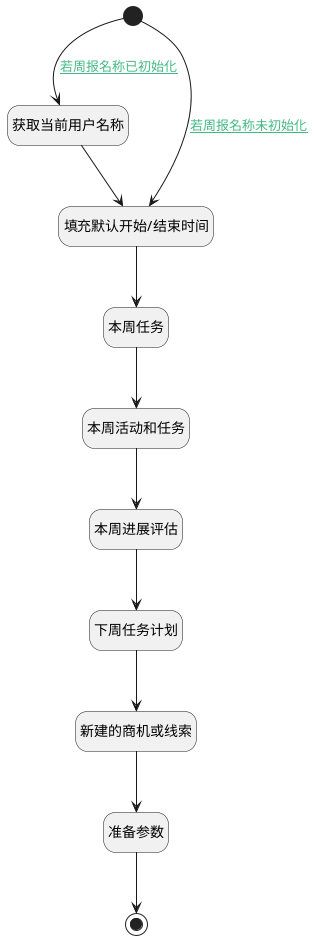

## 新建周报时加载关联信息 <!-- {docsify-ignore-all} -->

   新建周报时加载关联信息

### 处理过程




### 处理步骤说明

#### 本周任务 :id=RAWSQLCALL5<sup class="footnote-symbol"> <font color=gray size=1>[直接SQL调用]</font></sup>


<p class="panel-title"><b>执行sql语句</b></p>

```sql
select
	ID as TARGET_ID,
	SUBJECT  as NAME,
	'TASK' as TARGET_TYPE,
    START_TIME,
    PRIORITY,
    STATUS,
    COST,
    DESCRIPTION 
from
	TASK
where
	`TYPE` = 'TASK'
	and (CREATE_MAN = ?
		or OWNER = ?)
        and YEARWEEK(START_TIME , 1) = YEARWEEK(?, 1)
order by START_TIME desc		
```

<p class="panel-title"><b>执行sql参数</b></p>

1. `用户全局对象.srfpersonid`
2. `用户全局对象.userid`
3. `Default(传入变量).START_DATE(开始时间)`

重置参数`works(本周工作)`，并将执行sql结果赋值给参数`works(本周工作)`

#### 获取当前用户名称 :id=PREPAREPARAM3<sup class="footnote-symbol"> <font color=gray size=1>[准备参数]</font></sup>


1. 将`用户全局对象.srfusername` 设置给  `Default(传入变量).name(名称)`

#### 开始 :id=Begin<sup class="footnote-symbol"> <font color=gray size=1>[开始]</font></sup>


*- N/A*
#### 填充默认开始/结束时间 :id=RAWSFCODE1<sup class="footnote-symbol"> <font color=gray size=1>[直接后台代码]</font></sup>


<p class="panel-title"><b>执行代码[JavaScript]</b></p>

```javascript
var defaultInfo = logic.getParam("Default");

// 获取当前日期  
var now = new Date();  
// 获取当前周的第一天（周一）和最后一天（周日）  
function getFirstDayOfWeek(date) {  
    var day = date.getDay() || 7; // 如果 getDay() 返回 0，则视为周日  
    var diff = date.getDate() - day + (day === 0 ? -6 : 1); // 调整日期到周一  
    return new Date(date.setDate(diff));  
}  

function getLastDayOfWeek(date) {  
    var firstDay = getFirstDayOfWeek(date);  
    return new Date(firstDay.setDate(firstDay.getDate() + 6)); // 从周一开始加6天得到周日  
}  
  
// 格式化日期为 "YYYY-MM-DD" 字符串  
function formatDate(date) {  
    var year = date.getFullYear();  
    var month = date.getMonth() + 1; // 月份是从0开始的，所以需要+1  
    var day = date.getDate();  
    // 如果月份或日期是小于10的数字，则在前面添加一个'0'  
    month = (month < 10 ? '0' : '') + month;  
    day = (day < 10 ? '0' : '') + day;  
    return year + '-' + month + '-' + day;  
} 
  
// 获取当前周的开始和结束日期  
var startOfWeek = getFirstDayOfWeek(now);  
var endOfWeek = getLastDayOfWeek(now);  
  
// 格式化日期为字符串  
var startOfWeekString = formatDate(startOfWeek);  
var endOfWeekString = formatDate(endOfWeek);  
  
// 连接两个日期字符串为逗号分隔的字符串  
var dateRangeString = startOfWeekString+','+endOfWeekString;  
name = defaultInfo.get('name');

if(defaultInfo.get('start_date') == null && defaultInfo.get('end_date') == null){
    defaultInfo.set('start_date', startOfWeekString);
    defaultInfo.set('end_date', endOfWeekString);
    defaultInfo.set('date_scope', startOfWeekString + ',' + endOfWeekString);
}
if(defaultInfo.get('name') == sys.user().getUsername()){
    defaultInfo.set('name', name+startOfWeekString+'至'+endOfWeekString+'周报');
}

```

#### 本周活动和任务 :id=RAWSQLCALL1<sup class="footnote-symbol"> <font color=gray size=1>[直接SQL调用]</font></sup>


<p class="panel-title"><b>执行sql语句</b></p>

```sql
select
	ID as TARGET_ID,
	SUBJECT  as NAME,
	TYPE as TARGET_TYPE,
    COALESCE(START_TIME, DUE_DATE) AS START_TIME,
    PRIORITY,
    STATUS,
    COST,
    DESCRIPTION
from
	TASK
where
	 (CREATE_MAN = ?
		or OWNER = ?)
		and 
		( 
			(YEARWEEK(START_TIME , 1) = YEARWEEK(?, 1)and TYPE = 'MANEUVER')
			or 
			(YEARWEEK(DUE_DATE, 1) = YEARWEEK(?, 1) and TYPE = 'TASK' )
		)
order by START_TIME desc
```

<p class="panel-title"><b>执行sql参数</b></p>

1. `用户全局对象.srfpersonid`
2. `用户全局对象.userid`
3. `Default(传入变量).START_DATE(开始时间)`
4. `Default(传入变量).START_DATE(开始时间)`

将执行sql结果赋值给参数`activities(本周活动)`

#### 本周进展评估 :id=RAWSQLCALL2<sup class="footnote-symbol"> <font color=gray size=1>[直接SQL调用]</font></sup>


<p class="panel-title"><b>执行sql语句</b></p>

```sql
select
*
    
from
	note_attach T1
where
	YEARWEEK(T1.UPDATE_TIME  ,1) = YEARWEEK(?,1)
	and ((T1.UPDATE_MAN =?)
	or 
	(EXISTS (SELECT 1 FROM task_executor T2 WHERE T2.TASK_ID = T1.PRINCIPAL_ID AND T2.USER_ID = ?))
	or
	(EXISTS (SELECT 1 FROM executor T3 WHERE T3.PRINCIPAL_ID = T1.PRINCIPAL_ID AND T3.USER_ID = ?))

	)
order by T1.UPDATE_TIME desc
```

<p class="panel-title"><b>执行sql参数</b></p>

1. `Default(传入变量).START_DATE(开始时间)`
2. `用户全局对象.srfuserid`
3. `用户全局对象.userid`
4. `用户全局对象.userid`

将执行sql结果赋值给参数`notes(本周进展评估)`

#### 下周任务计划 :id=RAWSQLCALL3<sup class="footnote-symbol"> <font color=gray size=1>[直接SQL调用]</font></sup>


<p class="panel-title"><b>执行sql语句</b></p>

```sql
SELECT  
    ID as TARGET_ID,  
    SUBJECT as NAME,  
    'TASK' as TARGET_TYPE,
    PRIORITY,
    STATUS,
    DUE_DATE,
    DESCRIPTION
FROM  
    TASK  T1
WHERE  
    T1.`TYPE` = 'TASK'  
    AND EXISTS (SELECT 1 FROM task_executor T2 WHERE T2.TASK_ID = T1.ID AND T2.USER_ID = ?)
		AND T1.DUE_DATE >=  DATE_ADD(? + INTERVAL (7-WEEKDAY(?)) DAY, INTERVAL 0 DAY)
		AND T1.DUE_DATE <= DATE_ADD(?, INTERVAL (13-WEEKDAY(?)) DAY)
order by T1.DUE_DATE desc
```

<p class="panel-title"><b>执行sql参数</b></p>

1. `用户全局对象.userid`
2. `Default(传入变量).START_DATE(开始时间)`
3. `Default(传入变量).START_DATE(开始时间)`
4. `Default(传入变量).START_DATE(开始时间)`
5. `Default(传入变量).START_DATE(开始时间)`

将执行sql结果赋值给参数`tasks(任务)`

#### 新建的商机或线索 :id=RAWSQLCALL4<sup class="footnote-symbol"> <font color=gray size=1>[直接SQL调用]</font></sup>


<p class="panel-title"><b>执行sql语句</b></p>

```sql
(select t1.id,CONCAT('（',t2.account_name,'）',t1.subject) as name,t1.create_time,'线索' as `type`, 'LEAD' as `link_type`,t1.description from `lead` t1,account t2 where t1.account_id = t2.id and t1.create_time >= STR_TO_DATE(?, '%Y-%m-%d') and t1.create_time <= DATE_ADD(STR_TO_DATE(?, '%Y-%m-%d'), INTERVAL 1 DAY) and (t1.create_man = ? or t1.owner = ? or EXISTS (SELECT 1 FROM executor T11 WHERE T11.PRINCIPAL_ID = T1.id AND T11.USER_ID = ?))) 
union all
(select t1.id,CONCAT('（',t2.account_name,'）',t1.deal_name) as name,t1.create_time,'商机' as `type`, 'DEAL' as `link_type`,t1.description from `deal` t1,account t2 where t1.account_id = t2.id and t1.create_time >= STR_TO_DATE(?, '%Y-%m-%d') and t1.create_time <= DATE_ADD(STR_TO_DATE(?, '%Y-%m-%d'), INTERVAL 1 DAY) and (t1.create_man = ? or t1.owner = ? ))
ORDER BY create_time desc
```

<p class="panel-title"><b>执行sql参数</b></p>

1. `Default(传入变量).START_DATE(开始时间)`
2. `Default(传入变量).END_DATE(结束时间)`
3. `Default(传入变量).CREATE_MAN(建立人)`
4. `Default(传入变量).OWNER(销售人员)`
5. `Default(传入变量).OWNER(销售人员)`
6. `Default(传入变量).START_DATE(开始时间)`
7. `Default(传入变量).END_DATE(结束时间)`
8. `Default(传入变量).CREATE_MAN(建立人)`
9. `Default(传入变量).OWNER(销售人员)`

重置参数`news(新建)`，并将执行sql结果赋值给参数`news(新建)`

#### 结束 :id=END1<sup class="footnote-symbol"> <font color=gray size=1>[结束]</font></sup>


返回 `Default(传入变量)`

#### 准备参数 :id=PREPAREPARAM2<sup class="footnote-symbol"> <font color=gray size=1>[准备参数]</font></sup>


1. 将`activities(本周活动)` 设置给  `Default(传入变量).ACTIVITIES(活动)`
2. 将`works(本周工作)` 设置给  `Default(传入变量).WORKS(本周工作)`
3. 将`news(新建)` 设置给  `Default(传入变量).NEWS(新建数据)`
4. 将`tasks(任务)` 设置给  `Default(传入变量).TASKS(下周任务计划)`
5. 将`notes(本周进展评估)` 设置给  `Default(传入变量).NOTES(进展评估)`


### 连接条件说明
#### 若周报名称已初始化 :id=Begin-PREPAREPARAM3

`Default(传入变量).NAME(名称)` ISNULL
#### 若周报名称未初始化 :id=Begin-RAWSFCODE1

`Default(传入变量).NAME(名称)` ISNOTNULL


### 实体逻辑参数

|    中文名   |    代码名    |  数据类型    |  实体   |备注 |
| --------| --------| -------- | -------- | --------   |
|传入变量(<i class="fa fa-check"/></i>)|Default|数据对象|[周报(WEEKLIES)](module/crm/weeklies.md)||
|本周活动|activities|数据对象列表|[任务&活动(TASK)](module/crm/task.md)||
|新建|news|数据对象列表|||
|本周进展评估|notes|数据对象列表|[备注(NOTE_ATTACH)](module/crm/note_attach.md)||
|任务|tasks|数据对象列表|[任务&活动(TASK)](module/crm/task.md)||
|本周工作|works|数据对象列表|[任务&活动(TASK)](module/crm/task.md)||
