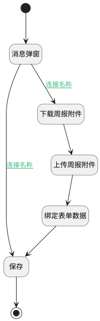

## 生成周报附件 <!-- {docsify-ignore-all} -->

   

### 处理过程




### 处理步骤说明

#### 开始 :id=Begin<sup class="footnote-symbol"> <font color=gray size=1>[开始]</font></sup>


#### 消息弹窗 :id=MSGBOX1<sup class="footnote-symbol"> <font color=gray size=1>[消息弹窗]</font></sup>


#### 下载周报附件 :id=RAWJSCODE1<sup class="footnote-symbol"> <font color=gray size=1>[直接前台代码]</font></sup>


<p class="panel-title"><b>执行代码</b></p>

```javascript
const appDataEntity = await ibiz.hub.getAppDataEntity(
    view.model.appDataEntityId,
    context.srfappid,
);
const appDEPrint = appDataEntity.appDEPrints.find(print => {
    return print.id === 'print';
});
if (appDEPrint) {
    let requestUrl = '';
    if (
        context &&
        context[appDataEntity.codeName.toLowerCase()]
    ) {
        requestUrl += `/${appDataEntity.deapicodeName2}/printdata/${
            context[appDataEntity.codeName.toLowerCase()]
        }`;
    } else {
        throw new Error(ibiz.i18n.t('runtime.uiAction.dataPrimaryKey'));
    }
    const res = await ibiz.net.request(requestUrl, {
        method: 'get',
        responseType: 'blob',
        params: {
            srfprinttag: appDEPrint.codeName,
            ...params,
        },
    });
    if (res.ok) {
        uiLogic.file = res.data;
    } else {
        throw new Error(ibiz.i18n.t('runtime.uiAction.printFailure'));
    }
} else {
    throw new Error(ibiz.i18n.t('runtime.uiAction.physicalPrint'));
}
```

#### 上传周报附件 :id=RAWJSCODE2<sup class="footnote-symbol"> <font color=gray size=1>[直接前台代码]</font></sup>


<p class="panel-title"><b>执行代码</b></p>

```javascript
 const urls = ibiz.util.file.calcFileUpDownUrl(context, params);
const files = uiLogic.file;
const reg = new RegExp(`(^| )ibzuaa-token=([^;]*)(;|$)`);
const arr = document.cookie.match(reg);
const headers = { Authorization: `Bearer ${arr[2]}` };
const result = await ibiz.util.file.fileUpload(
    urls.uploadUrl,
    uiLogic.file,
    headers,
);
uiLogic.attachment = result;
```

#### 绑定表单数据 :id=RAWJSCODE3<sup class="footnote-symbol"> <font color=gray size=1>[直接前台代码]</font></sup>


<p class="panel-title"><b>执行代码</b></p>

```javascript
const form = uiLogic.form;
if (form) {
    const data = uiLogic.form.state.data;
    const name = `${data.name || '周报'}.pdf`;
    const id = uiLogic.attachment.id;
    const value = [{name, id}];
    form.setDataValue('attachment', JSON.stringify(value));
}
```

#### 保存 :id=DEUIACTION1<sup class="footnote-symbol"> <font color=gray size=1>[实体界面行为调用]</font></sup>


调用界面行为异常，请检查配置平台相关配置

#### 结束 :id=END1<sup class="footnote-symbol"> <font color=gray size=1>[结束]</font></sup>


### 连接条件说明
#### 连接名称 :id=MSGBOX1-RAWJSCODE1

```lastReturn(上一次返回)``` EQ ```yes```
#### 连接名称 :id=MSGBOX1-DEUIACTION1

```lastReturn(上一次返回)``` EQ ```no```


### 实体逻辑参数

|    中文名   |    代码名    |  数据类型      |备注 |
| --------| --------| --------  | --------   |
|附件|file|数据对象||
|附件|attachment|数据对象||
|上一次返回|lastReturn|上一次调用返回||
|传入变量(<i class="fa fa-check"/></i>)|Default|数据对象||
|表单|form|部件对象||
