## 打开新建周报编辑视图 <!-- {docsify-ignore-all} -->

   

### 处理过程

```plantuml
@startuml
hide footbox
<style>
root {
  HyperlinkColor #42b983
}
</style>

hide empty description
state "开始" as Begin <<start>> [[$./open_new_edit#begin {开始}]]
state "获取表单属性" as RAWJSCODE1  [[$./open_new_edit#rawjscode1 {获取表单属性}]]
state "打开新建周报编辑视图" as DEUIACTION1  [[$./open_new_edit#deuiaction1 {打开新建周报编辑视图}]]


Begin --> RAWJSCODE1
RAWJSCODE1 --> DEUIACTION1


@enduml
```




### 处理步骤说明

#### 开始 :id=Begin<sup class="footnote-symbol"> <font color=gray size=1>[开始]</font></sup>


#### 获取表单属性 :id=RAWJSCODE1<sup class="footnote-symbol"> <font color=gray size=1>[直接前台代码]</font></sup>


<p class="panel-title"><b>执行代码</b></p>

```javascript
var form_data = view.layoutPanel.panelItems.form.control.data;
uiLogic.default.date_scope = form_data.date_scope;
uiLogic.default.start_date = form_data.start_date;
uiLogic.default.end_date = form_data.end_date;
uiLogic.default.name = form_data.name;
uiLogic.default.owner = form_data.owner;

```

#### 打开新建周报编辑视图 :id=DEUIACTION1<sup class="footnote-symbol"> <font color=gray size=1>[实体界面行为调用]</font></sup>


调用实体 [周报(WEEKLIES)](module/crm/WEEKLIES.md) 界面行为 [打开新建周报编辑视图](module/crm/WEEKLIES#界面行为) ，行为参数为`Default(传入变量)`


### 实体逻辑参数

|    中文名   |    代码名    |  数据类型      |备注 |
| --------| --------| --------  | --------   |
|传入变量(<i class="fa fa-check"/></i>)|Default|数据对象||
|当前视图对象|view|当前视图对象||
