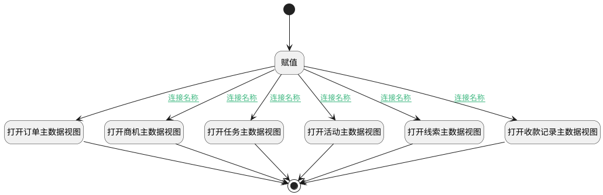

## 根据业务类型打开对应主数据视图 <!-- {docsify-ignore-all} -->

   

### 处理过程




### 处理步骤说明

#### 打开线索主数据视图 :id=DEUIACTION1<sup class="footnote-symbol"> <font color=gray size=1>[实体界面行为调用]</font></sup>


调用实体 [线索(LEAD)](module/crm/lead.md) 界面行为 [打开线索主数据视图](module/crm/lead#界面行为) ，行为参数为`Default(传入变量)`

#### 打开商机主数据视图 :id=DEUIACTION2<sup class="footnote-symbol"> <font color=gray size=1>[实体界面行为调用]</font></sup>


调用实体 [商机(DEAL)](module/crm/deal.md) 界面行为 [打开商机主数据视图](module/crm/deal#界面行为) ，行为参数为`Default(传入变量)`

#### 打开活动主数据视图 :id=DEUIACTION3<sup class="footnote-symbol"> <font color=gray size=1>[实体界面行为调用]</font></sup>


调用实体 [任务&活动(TASK)](module/crm/task.md) 界面行为 [打开活动主数据视图](module/crm/task#界面行为) ，行为参数为`Default(传入变量)`

#### 开始 :id=Begin<sup class="footnote-symbol"> <font color=gray size=1>[开始]</font></sup>


#### 赋值 :id=PREPAREJSPARAM1<sup class="footnote-symbol"> <font color=gray size=1>[准备参数]</font></sup>


1. 将`Default(传入变量).target_id` 设置给  `Default(传入变量).id`
2. 将`Default(传入变量).target_name` 设置给  `ctx(应用上下文变量).principal_name`

#### 结束 :id=END1<sup class="footnote-symbol"> <font color=gray size=1>[结束]</font></sup>


#### 打开订单主数据视图 :id=DEUIACTION4<sup class="footnote-symbol"> <font color=gray size=1>[实体界面行为调用]</font></sup>


调用实体 [订单(PROJECT)](module/crm/project.md) 界面行为 [打开订单主数据视图](module/crm/project#界面行为) ，行为参数为`Default(传入变量)`

#### 打开收款记录主数据视图 :id=DEUIACTION5<sup class="footnote-symbol"> <font color=gray size=1>[实体界面行为调用]</font></sup>


调用实体 [收款记录(PAYEE)](module/crm/payee.md) 界面行为 [打开收款记录详情页](module/crm/payee#界面行为) ，行为参数为`Default(传入变量)`

#### 打开任务主数据视图 :id=DEUIACTION6<sup class="footnote-symbol"> <font color=gray size=1>[实体界面行为调用]</font></sup>


调用实体 [任务&活动(TASK)](module/crm/task.md) 界面行为 [打开任务主数据视图](module/crm/task#界面行为) ，行为参数为`Default(传入变量)`

### 连接条件说明
#### 连接名称 :id=PREPAREJSPARAM1-DEUIACTION1

```Default(传入变量).target_type``` EQ ```LEAD```
#### 连接名称 :id=PREPAREJSPARAM1-DEUIACTION2

```Default(传入变量).target_type``` EQ ```DEAL```
#### 连接名称 :id=PREPAREJSPARAM1-DEUIACTION3

```Default(传入变量).target_type``` EQ ```MANEUVER```
#### 连接名称 :id=PREPAREJSPARAM1-DEUIACTION4

```Default(传入变量).target_type``` EQ ```PROJECT```
#### 连接名称 :id=PREPAREJSPARAM1-DEUIACTION5

```Default(传入变量).target_type``` EQ ```PAYEE```
#### 连接名称 :id=PREPAREJSPARAM1-DEUIACTION6

```Default(传入变量).target_type``` EQ ```TASK```


### 实体逻辑参数

|    中文名   |    代码名    |  数据类型      |备注 |
| --------| --------| --------  | --------   |
|应用上下文变量|ctx|导航视图参数绑定参数||
|传入变量(<i class="fa fa-check"/></i>)|Default|数据对象||
